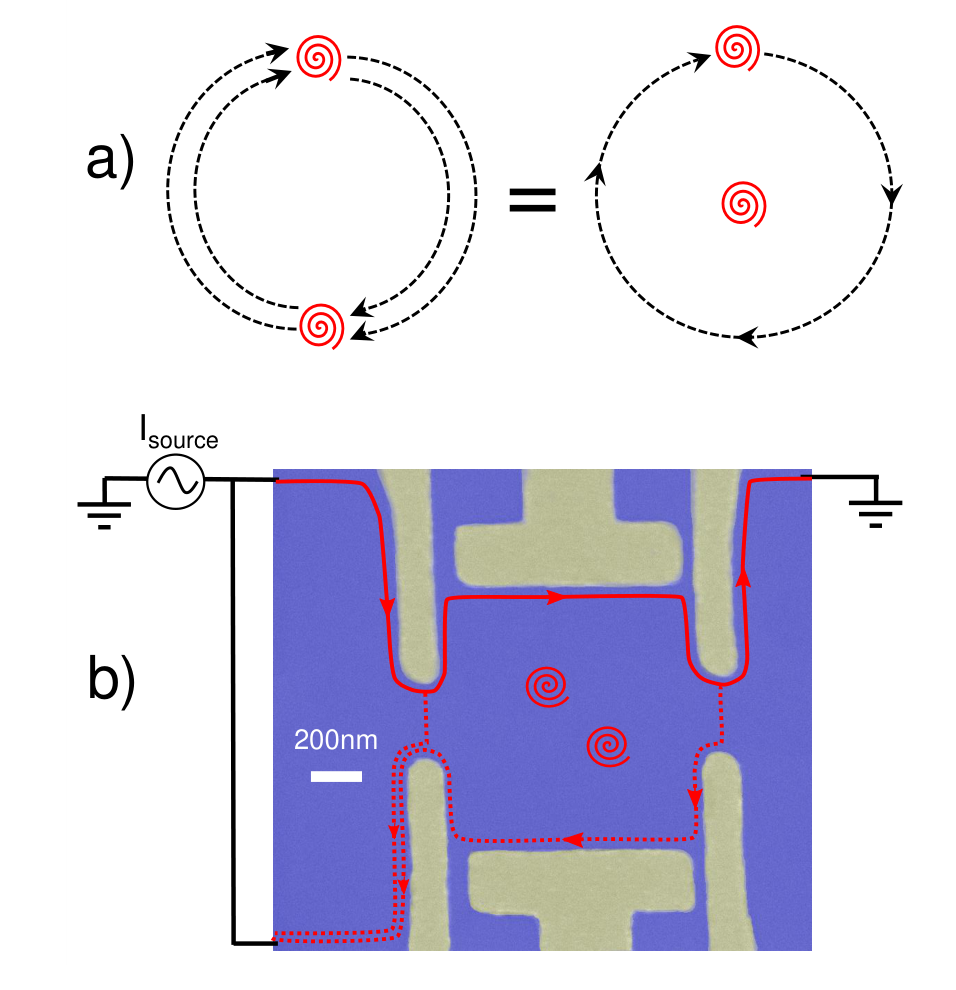
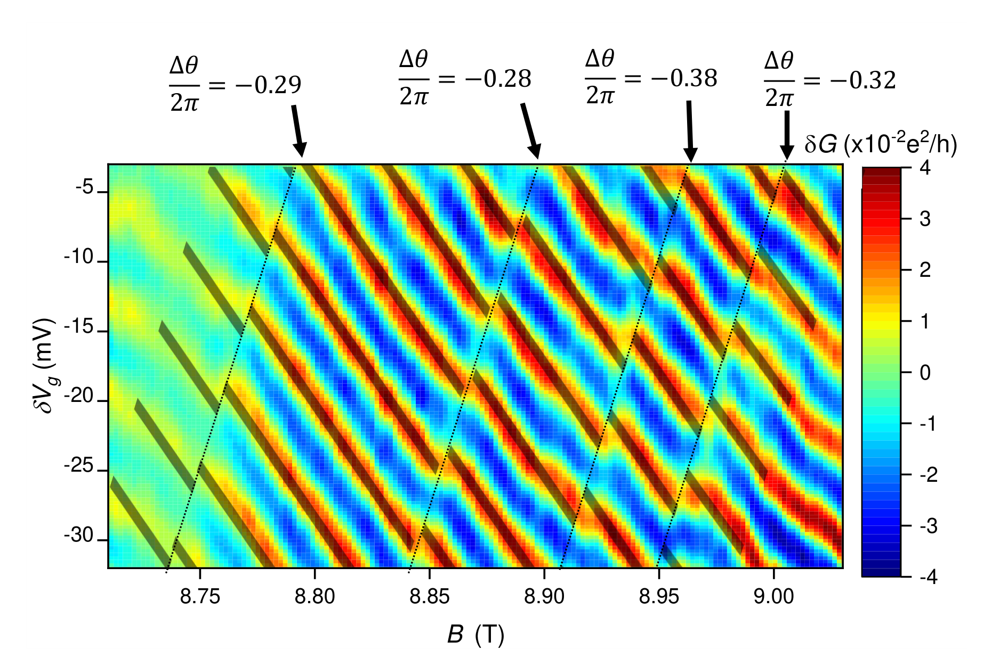
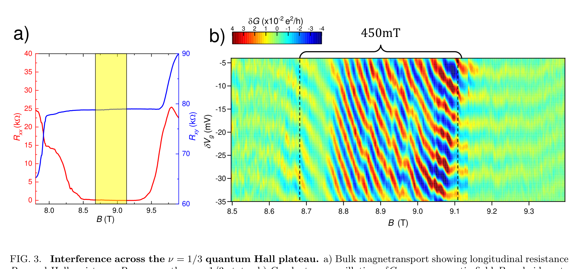
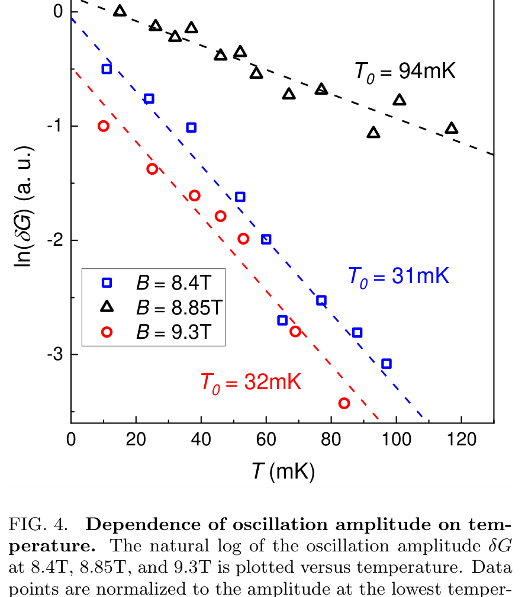

# ν=1/3 fractional quantum Hall state에서 anyonic braiding statistics의 직접 관측

*Direct observation of anyonic braiding statistics at the ν=1/3 fractional quantum Hall state*

> 원문: arXiv:2006.14115v1 [cond-mat.mes-hall], 2020년 6월 25일
> 본문(main text) 한국어 번역

J. Nakamura,$^{1,2}$ S. Liang,$^{1,2}$ G. C. Gardner,$^{2,3}$ and M. J. Manfra$^{1,2,4,3,5,*}$

$^1$*Department of Physics and Astronomy, Purdue University*
$^2$*Birck Nanotechnology Center, Purdue University*
$^3$*Microsoft Quantum Purdue, Purdue University*
$^4$*School of Electrical and Computer Engineering, Purdue University*
$^5$*School of Materials Engineering, Purdue University*

(Dated: June 26, 2020)

---

## 초록 (Abstract)

Coulomb charging effect가 억제된 electronic Fabry-Perot interferometer를 활용하여, 우리는 ν = 1/3 fractional quantum Hall state에서 anyonic braiding statistics의 실험적 관측을 보고한다. ν = 1/3 edge mode의 강한 Aharonov-Bohm interference 사이사이에는 $\theta_{anyon} = \frac{2\pi}{3}$의 anyonic phase와 일치하는 이산적인(discrete) phase slip이 끼어든다. 우리의 결과는, 소자의 charging energy가 charged quasiparticle 형성 energy에 비해 작은 영역에서 작동하는 Fabry-Perot interferometer에 대한 최근 이론 [17]과 일치한다. 소자의 동작과 이론적 예측 사이의 긴밀한 대응은 anyonic braiding을 관측했다는 우리의 주장을 뒷받침한다.

---

## BACKGROUND

양자 이론은 모든 fundamental particle이 fermion 또는 boson이어야 함을 요구하며, 이는 입자의 statistical behavior에 깊은 함의를 갖는다. 그러나 이론적 연구들은 2차원에서는 입자가 이 원리를 위배하고 이른바 anyonic statistics를 따르는 것이 가능함을 보였다. anyonic statistics에서는 입자 위치의 교환(exchange)이 (fermion이나 boson에서처럼) π 또는 2π가 아니라 π의 유리수 분율(rational fraction)에 해당하는 양자역학적 phase 변화를 일으킨다 [1, 2]. anyon은 자연계에 fundamental particle로 존재할 수는 없지만, 특정 condensed matter 계는 어떤 형태의 anyonic statistics를 따르는 exotic quasiparticle을 호스팅할 것으로 예측된다.

quantum Hall effect는, 2차원 전자계(2DES, two-dimensional electron system)를 낮은 온도로 냉각하고 강한 magnetic field에 두었을 때 나타나는 topological phase of matter의 두드러진 예이다. quantum Hall regime에서 bulk는 절연체를 형성하고, 전하는 edge current를 따라 흐르는데 이 edge current는 backscattering으로부터 topology적으로 보호되며 quantized conductance를 나타낸다. fractional quantum Hall state [3]의 elementary excitation은 단순한 전자가 아니다. 전자는 fermionic statistics를 따르지만, 이들은 대신 fractional charge와 anyonic statistics를 포함한 매우 exotic한 성질을 가질 것으로 예측되는 emergent quasiparticle이다 [4]. 2차원에서, 입자 위치의 두 번의 교환은 한 quasiparticle이 다른 quasiparticle을 닫힌 경로로 한 바퀴 도는 것과 topology적으로 동등하며 [5], 이를 braid라 부른다. 이는 그림 1a에 나타나 있다. 이 quasiparticle들의 anyonic한 성격은 braiding으로부터 계가 얻는 fractional phase에 반영되며, 따라서 이들은 anyonic braiding statistics를 따른다고 말한다. fractional quantum Hall state의 statistics는 이론적 [6, 7] 연구와 수치적 [8–12] 연구로 다루어져 왔다. anyonic phase는 택한 경로에 의존하지 않고 오직 둘러싸인 quasiparticle의 수에만 의존하며, 이로써 braiding은 quantum Hall physics에서 topology가 발현되는 또 하나의 양상이 된다. 이러한 topology적 robustness는 다양한 condensed matter 계에서 braiding 연산에 기반한 fault-tolerant quantum computation에 대한 적극적인 추구를 동기 부여해 왔다 [5, 13–15]. 최근의 한 실험 연구에서는 noise correlation 측정으로부터 anyonic statistics가 추론되었다 [16]. 그러나 braiding 실험에서 anyonic phase를 직접 관측하는 것은 quantum Hall quasiparticle의 exotic한 거동에 대한 이해를 더욱 진전시킬 것이며, quasiparticle 조작(manipulation)으로 나아가기 위한 필수적인 단계이다.

electronic interferometry는 이전의 이론적 [17–25] 연구와 실험적 [26–45] 연구에서 edge physics를 연구하는 데 사용되어 왔으며, 매우 exotic한 non-Abelian 형태의 anyonic statistics [48–55]를 포함하여 anyonic braiding statistics를 관측하는 실험적 수단으로 제안되어 왔다 [18, 20, 46, 47]. electronic Fabry-Perot interferometer는, 그림 1b에 나타낸 것처럼 quantum point contact(QPC)를 사용하여 edge current를 분할하는 confined 2DES로 이루어진다. QPC에 의해 backscatter된 quasiparticle은 interferometer 내부에 localize된 quasiparticle 둘레를 braid하게 된다. 따라서 interferometer 내부에 localize된 quasiparticle 수 $N_{qp}$의 변화는 anyonic 기여 $\theta_{anyon}$ 때문에 interference phase의 변화(shift)를 일으킨다 [18, 20, 46, 47]. 여기서 Laughlin fractional quantum Hall state $\nu = \frac{1}{2p+1}$에 대해 $\theta_{anyon} = \frac{2\pi}{2p+1}$이다 [6, 7]. interferometer phase 차이 $\theta$는 quasiparticle charge $e^*$로 scale된 Aharonov-Bohm phase와 anyonic 기여의 결합이며, Eqn. 1과 같이 쓸 수 있다 [18, 20, 46]:

$$\theta = 2\pi\frac{e^*}{e}\frac{A_I B}{\Phi_0} + N_{qp}\theta_{anyon} \tag{1}$$

interferometer에 의해 backscatter되는 총 전류는 $\cos(\theta)$에 의존하므로, interference phase는 소자 양단의 conductance $G$를 측정함으로써 탐지할 수 있다 [58].

interferometry를 통한 anyonic phase 관측의 큰 장애물은, interfere하는 edge state와 interferometer의 bulk에 위치한 전하 사이의 Coulomb interaction이었다 [19]. 강한 bulk-edge interaction은 bulk의 전하가 변할 때 interferometer의 면적 $A_I$를 변하게 한다 [19, 20]. 그 결과, 강한 bulk-edge interaction을 갖는 이른바 Coulomb-dominated 소자에서는, $N_{qp}$가 바뀔 때 $A_I$의 변화로 인한 Aharonov-Bohm phase 변화가 anyonic phase $\theta_{anyon}$을 상쇄하여 quasiparticle braiding statistics를 관측 불가능하게 만든다 [20]. Coulomb-dominated 소자에서도 새로운 physics가 탐구되어 왔지만 [30, 32, 34, 45, 56, 57], anyonic braiding을 관측 가능하게 하려면 이 bulk-edge interaction을 줄여야 한다. 이 Coulomb bulk-edge interaction을 줄이기 위해 여러 기법이 구현되어 왔는데, metal screening gate의 사용 [30, 34], doping layer에 의한 screening을 강화하기 위한 저온 illumination [52, 54, 55], interferometer 내부에 Ohmic contact 추가 [39], semiconductor heterostructure 내부에 보조 screening layer 도입 [58] 등이 있다. screening layer 기법은 fractional quantum Hall state에서도 robust한 Aharonov-Bohm interference를 나타내는 작고 매우 coherent한 interferometer의 사용을 가능하게 했다 [58].

## DEVICE DESIGN

이 실험에 사용된 소자는, bulk-edge interaction을 최소화하기 위한 screening layer를 갖춘 독특한 high-mobility GaAs/AlGaAs heterostructure [59, 60]를 활용한다(layer stack은 Supp. Fig. 1 참조) [58]. interferometer는, 아래의 2DES를 deplete하도록 음(-)으로 bias된 metal surface gate를 사용하여 정의된다. 두 개의 좁은 constriction이 edge current를 backscatter하기 위한 QPC를 정의하고, 더 넓은 side gate가 interference 경로의 나머지 부분을 정의한다. 소자의 SEM 이미지는 그림 1b에 나타나 있다. 소자의 공칭(nominal) 면적은 $1.0\mu m\times1.0\mu m$이며, 측정 결과는 2DES의 lateral depletion이 interferometer 면적을 각 변마다 약 200nm씩 줄인다는 것을 시사하는데, 이는 [58]의 실험 및 수치 결과와 유사하다([61]도 참조). interferometer의 길이 scale은 우리가 조사한 영역에서 magnetic length $l_B \equiv \sqrt{\frac{\hbar c}{eB}}$보다 훨씬 크다는 점에 유의하라. ν = 1/3에서 $l_B \approx 9$nm이므로, interfere하는 quasiparticle이 자신이 braid할 수 있는 interferometer 내부의 localize된 quasiparticle과 충분히 떨어져 있어야 한다는 조건이 성립할 것이다 [10, 11]. [58]에서 사용된 소자와 비교하여, 이 연구에서 사용된 소자는 더 낮은 전자 밀도 $n$을 갖는데, 이는 더 작은 gate voltage를 사용할 수 있게 하여 소자 안정성을 개선한다. 또한 이 소자는 다소 더 작은 면적을 가지며, 이는 interference의 coherence와 visibility를 높일 수 있다. 실험은 base mixing chamber 온도 $T \approx 10$mK의 dilution refrigerator에서 수행된다. 서로 다른 quantum dot 소자의 Coulomb blockade 측정은 다소 더 높은 전자 온도 $T \approx 22$mK를 시사한다. QPC gate에는 $\approx$-1V, side gate에는 $\approx$-0.8V의 음(-)전압이 인가된다. conductance는 side gate voltage 변화량 $\delta V_g$의 함수로 측정되는데, $\delta V_g$는 -0.8V 기준의 상대값이며 두 side gate 모두에 인가된다. 소자 중심부에 추가된 metal gate(명료성을 위해 그림 1b에는 표시하지 않음)는 ground potential로 유지되므로 그 아래 2DES 밀도에 영향을 주지 않는다. 이 gate는 gate들에 의한 confining potential을 더 sharp하게 만들기 위한 것이다. 측정은 표준적인 4-terminal 및 2-terminal lock-in amplifier 기법으로 수행된다.

## DISCRETE PHASE SLIPS

우리는 filling factor ν = 1/3 quantum Hall state에서 높은 magnetic field $B$로 소자를 작동시켰다. 그림 2에는 ν = 1/3 conductance plateau 중심 부근에서 interferometer 양단에 측정된 conductance 변화량 $\delta G$를 $B$와 $\delta V_g$의 함수로 나타냈다. QPC는 이 영역 전체에 걸쳐 약 90%의 transmission으로 weak backscattering regime에 머무르며, interference oscillation을 명확히 볼 수 있도록 부드러운 background conductance를 빼냈다. 그림에서 볼 수 있듯이, 관측된 지배적 거동은 음(-)의 기울기를 갖는 등위상선(lines of constant phase)을 보이는 conductance oscillation이다. 그러나 매우 뚜렷하게도 데이터에는 소수의 이산적인 phase jump도 존재하며, 점선은 이러한 특징에 대한 안내선이다. 이 phase jump들은 이후의 scan에서도 재현 가능한 것으로 확인되었다. Supp. Fig. 5 참조.

Eqn. 1은 우리의 관측에 대한 직접적인 설명을 제공한다. 음(-)의 기울기를 갖는 등위상선을 동반한 연속적인 phase 변화는 Aharonov-Bohm effect의 특징(signature)이다 [20]. 이는 $\theta$와 $N_{qp}$를 고정한 채 Eqn. 1을 미분하여 확인할 수 있으며, 그 결과는 $\frac{\partial V_g}{\partial B} = -\frac{1}{\beta}\frac{A_I}{B}$이다(여기서 $\beta \equiv \frac{\partial A_I}{\partial V_g}$는 side gate voltage에 따른 interferometer 면적 변화를 매개변수화한다). 음(-)의 부호는 등위상선이 음(-)의 기울기를 가짐을 의미하며, 이는 integer [26, 30, 34] 및 fractional [58] quantum Hall regime의 이전 실험에서 관측된 바와 같다. Eqn. 1의 두 번째 항은 localize된 quasiparticle 수가 변할 때 phase에 이산적인 변화가 일어남을 예측한다. 따라서 이산적인 phase jump를 anyonic phase 기여 $\theta_{anyon}$과 연관 짓는 것은 자연스럽다. 주목할 점은, 이산적인 phase jump가 $B$–$V_g$ 평면에서 양(+)의 기울기를 갖는 선을 가로질러 일어난다는 것이다. 이는 $B$를 증가시키면 bulk로부터 quasiparticle을 제거(또는 quasihole을 생성)할 것으로 예상되는 반면 [4, 18], gate voltage를 증가시키면 localize된 quasiparticle 수를 늘리는 것이 electrostatic하게 유리해진다는 사실로 이해할 수 있다. 따라서 quasiparticle 제거가 유리해지는 magnetic field 값은 gate voltage가 증가할 때 함께 증가해야 하며, quasiparticle transition에 양(+)의 기울기가 예상되는데, 이는 resonant tunneling 실험에서 관측된 바와 같다 [32, 41, 56, 57, 62]. 우리가 실제로 양(+)의 기울기를 관측한다는 사실은 이러한 이산적인 phase jump가 localize된 quasiparticle 수의 변화와 연관되어 있음을 강하게 시사하며, 그 기울기의 크기 또한 이와 일치한다. 추가 분석은 Supp. Discussion 1을 참조하라. 더 나아가, quantum Hall 이론의 핵심 원리 중 하나는 quasiparticle이 disorder potential의 언덕과 골짜기에 localize된다는 것이며 [63], 이산적인 phase jump가 불규칙한 간격으로 나타난다는 사실은 그 위치가 실제로 예상대로 disorder에 의해 결정됨을 가리킨다.

데이터의 각 phase jump와 연관된 phase 변화 값을 결정하기 위해, 우리는 phase jump 사이의 영역에서 least-squares fit을 수행하였다. conductance 데이터를 $\delta G = \delta G_0\cos(2\pi\frac{1}{3}\frac{A_I B}{\Phi_0} + \theta_0)$ 형태로 fitting하였으며, fitting 매개변수는 $\theta_0$이다. 이 conductance 표현식은, 이산적인 phase jump 사이에서 phase가 오직 $B$ 변화와 ($V_g$ 변화를 통한) $A_I$ 변화에 따른 Aharonov-Bohm phase 변화로만 진화한다고 가정하며, $\theta_0$는 Aharonov-Bohm effect로 돌릴 수 없는 잉여(excess) phase이다. 우리는 인접한 영역들에서 fitting된 $\theta_0$ 값의 차이인 $\Delta\theta$를 계산하여 phase jump 값을 결정한다. fitting된 데이터는 그림 2에 강조 표시되어 있으며, 추출된 $\frac{\Delta\theta}{2\pi}$ 값이 각 jump 위에 표시되어 있다. 평균을 취하고 각 phase jump가 quasiparticle 하나의 제거(또는 동등하게 quasihole 하나의 추가)에 해당한다고 가정하면, 우리는 $\theta_{anyon} = 2\pi\times(0.31\pm0.04)$를 얻는다. 이는 ν = 1/3 state에 대한 이론값 $\theta_{anyon} = \frac{2\pi}{3}$과 일치한다 [6, 7]. 따라서 우리의 데이터는 ν = 1/3 quantum Hall state에서 fractional braiding statistics에 대한 예측의 실험적 확인을 제공한다.

## TRANSITION FROM CONSTANT FILLING TO CONSTANT DENSITY

최근의 한 이론 연구는, 강한 screening을 활용하여 특성 Coulomb charging energy를 줄이고 그로써 bulk-edge interaction을 억제하는, ν = 1/3 state에서 작동하는 Fabry-Perot interferometer의 경우를 분석하였다 [17]. 핵심 예측은, magnetic field가 state의 중심에서 멀어지고 chemical potential이 density of states에서 gap의 중심으로부터 멀어질 때, 소자가 constant filling factor regime에서 constant electron density regime으로 transition한다는 것이다. 저자들은 넓은 magnetic field 범위에 걸쳐 bulk 2DES가 고정된 ν = 1/3 filling을 유지함을 발견한다. 이 constant ν regime에서 phase에 대한 지배적 기여는 Aharonov-Bohm phase이지만, 소수의 잘 분리된 quasiparticle transition이 일어나야 하며 이로부터 $\theta_{anyon}$을 추출할 수 있는데, 이는 위에서 기술한 우리의 결과와 일치한다. magnetic field가 중심에서 멀어지면, 고정된 ν를 유지하기 위해 density를 변화시키는 데 드는 electrostatic energy 비용이 constant filling factor에서 constant density로의 transition을 일으킬 것이라고 저자들은 예측한다. constant density regime에서는, 총 전하를 고정시키기 위해 (낮은 field에서는) 다수의 quasiparticle 또는 (높은 magnetic field에서는) 다수의 quasihole이 interferometer 내부에 생성되며, flux가 flux quantum $\Phi_0$ 하나만큼 변할 때 quasiparticle 또는 quasihole 하나가 생성되어, anyonic phase가 매개하는 interference 거동의 상당한 변화를 일으킨다.

이러한 예측에 동기를 받아, 우리는 ν = 1/3 fractional quantum Hall state에 걸쳐 넓은 magnetic field 범위에서 interferometer를 작동시켰다. ν = 1/3에서 longitudinal resistance $R_{xx}$가 사라지고 Hall resistance $R_{xy}$에 quantized plateau가 나타나는 bulk magnetotransport는 그림 3b에 나타나 있다. 이는 그림 2와 동일한 측정이지만 더 높고 더 낮은 magnetic field로 확장한 것이다. 앞서 논의했듯이, ν = 1/3 plateau 중심 부근에서 conductance에 관측된 지배적 거동은, quasiparticle transition으로 돌릴 수 있는 소수의 이산적인 jump를 동반한, Aharonov-Bohm interference [18–20, 58]와 일치하는 음(-)의 기울기 등위상선이다. gate voltage 및 magnetic field oscillation 주기는 ν = 1에서 측정된 integer 주기보다 약 3배 크며, 이는 ν = 1/3 state에서 예상되는 대로 e/3 fractional charge를 갖는 quasiparticle의 interference와 일치하고, fractional charge에 대한 이전의 실험적 관측과도 일치한다 [34, 58, 64–66]. 그러나 이 중심 영역의 양쪽에서는 거동이 크게 변한다. 등위상선이 음(-)의 기울기를 잃는다. 패턴에 여전히 약한 magnetic field 의존성이 있긴 하지만, phase가 변하는 magnetic field scale이 중심 영역에서보다 훨씬 커서 등위상선이 거의 평평해지며, oscillation은 주로 side gate voltage에만 의존하게 된다. 주목할 점은, 이러한 뚜렷한 변화에도 불구하고 등위상선이 중심의 Aharonov-Bohm 영역으로부터 위·아래 영역으로의 transition을 가로질러 연속적이라는 것이며, 이는 oscillation이 여전히 edge state의 interference에 기인함을 가리킨다.

음(-)의 기울기를 갖는 Aharonov-Bohm interference가 유한한 magnetic field 범위에서만 일어난다는 우리의 실험적 관측은 [17]의 예측과 부합한다. 언뜻 보면 이 중심 영역의 위·아래에서 관측된 거동은 예측과 충돌하는 것처럼 보인다. 즉 우리는 magnetic field에 거의 무관해지는 interference 패턴을 관측하는 반면, [17]은 quasiparticle이 주기 $\Phi_0$로 생성되기 때문에 magnetic field 주기가 중심 영역의 $3\Phi_0$에서 위·아래 영역의 $\Phi_0$로 감소할 것이라고 예측한다. 그러나 [17]의 또 다른 핵심 예측은, 이 $\Phi_0$ oscillation이 thermal smearing에 극도로 취약하다는 것이다. 저자들은 우리 소자에 대해 온도 scale $T_0 \approx 2$mK를 추정한다. 우리 소자는 [17]에서 고려한 것보다 작으므로, 이 예측된 온도 scale은 우리 소자에 대해 $T_0 \approx 4$mK가 되는데, 이는 여전히 우리가 추정한 전자 온도 $T \approx 22$mK보다 훨씬 작다. 이 thermal smearing은, constant density regime이 chemical potential이 density of states가 높은 위치에 있는 상황에 해당하며 따라서 state 사이의 energy 간격이 작아 thermal smearing으로 이어진다는 사실로 이해할 수 있다. 따라서 $T \approx 22$mK에서 $\Phi_0$ oscillation이 부재하다는 것은 실제로 [17]과 부합한다.

등위상선이 평평해지고 magnetic field에 무관해진다는 사실은, Aharonov-Bohm phase와 anyonic phase의 결합된 기여(Eqn. 1)에 기반하여 이해할 수 있다. ν = 1/3 state에 대해, quasiparticle은 fractional charge $e^* = e/3$과 fractional braiding statistics $\theta_{anyon} = 2\pi/3$을 가질 것으로 예측된다 [6]. 소자에 flux quantum 하나를 더하도록 magnetic field를 바꾸면 Aharonov-Bohm phase가 $\frac{2\pi}{3}$만큼 변한다. 추가로, 낮은 field regime에서는 quasiparticle 하나가 제거되고, 높은 field regime에서는 quasihole 하나가 추가되어, $-\frac{2\pi}{3}$의 phase shift를 일으키고 두 regime 모두에서 총 interference phase를 변하지 않게 만든다. Aharonov-Bohm phase는 연속적으로 변하는 반면, (영온 극한에서) quasiparticle 수는 이산적으로 변하여 예측된 $\Phi_0$ oscillation으로 이어진다 [17, 18]. 그러나 quasiparticle 수가 thermal smear될 때에는, localize된 quasiparticle의 평균 수가 거의 연속적으로 변하여 anyonic phase의 부드러운 변화로 이어진다. 이 경우 부드럽게 변하는 thermally-averaged anyonic phase가 Aharonov-Bohm phase를 상쇄하여, $B$가 변해도 $\theta$에 변화가 없게 되며, 이는 우리의 실험적 관측과 일치한다. 1/3 state에서 각 quasiparticle은 vortex이므로, 이는 vortex가 닫힌 경로를 한 바퀴 돌 때의 Berry phase가 $2\pi\langle q_{enc}\rangle$과 같다는 [6]의 결과로도 이해할 수 있다. 여기서 $q_{enc}$는 경로 안에 둘러싸인 전하이며, 높고 낮은 field 영역에서는 electrostatics가 density를 고정되게 강제하므로 $\langle q_{enc}\rangle$이 거의 일정하게 유지된다.

음(-)의 기울기를 갖는 Aharonov-Bohm oscillation이 일어나는 대략적인 범위는 그림 3a에 점선으로 표시되어 있으며, 약 450mT의 폭을 갖는다. 이론과의 정량적 비교를 위해, 우리는 [17]로부터 고정된 ν 영역의 예측 폭을 계산한다: $\Delta B_{constant-\nu} = \frac{\Delta_{1/3}\Phi_0 C_{SW}}{\nu e^2 e^*}$. 이 표현식에서 $\Delta_{1/3}$은 ν = 1/3 state의 energy gap으로, 우리는 이를 $\approx 5.5$K로 측정하였다(Supp. Fig. 3 참조). 이는 ν = 1/3 gap에 대한 이전 측정과 일치한다 [67]. $C_{SW}$는 screening layer와 quantum well 사이의 단위 면적당 capacitance로, 우리는 이를 $C_{SW} = \frac{2\epsilon}{d}$로 계산한다. 여기서 인수 2는 screening layer가 두 개라는 사실을 반영하며, $d = 48$nm는 quantum well로부터 screening layer의 setback 거리이다. 소자의 실험값을 사용하면 $\Delta B_{fixed-\nu} \approx 530$mT라는 예측값을 얻는데, 이는 실험적으로 관측된 Aharonov-Bohm interference 범위 $\approx 450$mT와 잘 일치하며, 이는 실험적으로 관측된 interference 거동의 transition이 실제로 [17]의 모델로 설명될 수 있음을 시사한다.

추가로, 높고 낮은 field 영역에서는 중심 영역에 비해 side gate voltage oscillation 주기가 적당히(moderate) 감소한다. Supp. Discussion 1에서 우리는 이 주기 shift를 분석하고, bulk 전하 변화를 관련짓는 매개변수 $\alpha_{bulk}$와 edge 전하 변화를 side gate voltage에 관련짓는 매개변수 $\alpha_{edge}$를 추출한다. 이 매개변수들을 사용하여, 우리는 주기의 shift가 gate voltage에 따른 quasiparticle 및 quasihole 생성과 일치하며, 이것이 statistical phase를 통해 주기 변화로 이어진다는 것을 알아낸다. 또한, 우리는 [20]과 [17]의 모델에 기반한 interferometer 거동의 수치 시뮬레이션을 수행하였으며, 이는 실험과 좋은 정성적 일치를 보인다. Supp. Discussion 2와 Supp. Fig. 5 참조.

종합하면, ν = 1/3 중심 부근의 이산적인 phase jump 관측은, [17]의 예측과 부합하는 높고 낮은 field에서의 거동 transition과 함께, anyonic quasiparticle의 statistical phase가 interference phase에 기여하는 일관된 그림을 제공한다. 우리의 데이터는, chemical potential이 energy gap의 중심 부근에 있어 density of states가 작고 개별 quasiparticle transition을 분해할 수 있는 regime에서, 그리고 density of states가 높고 quasiparticle 및 quasihole state의 연속체(continuum)가 phase에 기여하는 gap 위·아래의 regime에서, 모두 braiding의 영향을 가리킨다.

state의 중심에서 멀어질 때 constant ν regime에서 constant $n$ regime으로 transition한다는 [17]의 논의는 integer quantum Hall state에도 적용된다. Supp. Fig. 6에서 우리는 integer state ν = 1에 걸쳐 $B$와 $V_g$의 함수로서 interference 측정을 보인다. fractional한 ν = 1/3의 경우와 대조적으로, 소자는 거동에 변화를 보이지 않으며 plateau의 높고 낮은 field 양 끝에서 음(-)의 기울기를 갖는 Aharonov-Bohm interference를 나타낸다. 이는 charge carrier와 excited state가 fermionic statistics를 따르는 전자라는 사실과 일치하며, 이로써 그들의 braiding은 관측 불가능하다($\theta_{fermion} = 2\pi$).

## TEMPERATURE DEPENDENCE

추가적인 관측은, oscillation 진폭이 중심 영역에서보다 높은 field 및 낮은 field 영역에서 온도에 따라 훨씬 더 가파르게 감쇠한다는 것이다. 우리는 각 영역에서 oscillation 진폭을 온도의 함수로 측정하였다. 온도가 증가함에 따라 oscillation은 $T$에 대해 대략 지수함수적으로 감쇠하며, oscillation 진폭이 $e^{\frac{-T}{T_0}}$로 변한다고 가정하여 각 영역을 온도 감쇠 scale $T_0$로 특징지을 수 있다 [18, 50, 51, 68]. 우리는 oscillation 진폭의 자연로그를 온도의 함수로 한 linear fit을 통해 $T_0$를 추출하며, 이 데이터는 그림 4에 나타나 있다. 8.4T의 낮은 field 영역(파란색)에서는 $T_0 = 31$mK, 8.85T의 중심 영역(검은색)에서는 $T_0 = 94$mK, 9.3T의 높은 field 영역(빨간색)에서는 $T_0 = 32$mK이다. edge-state velocity를 추출하기 위한 differential conductance 측정이 수행되었으며 [18, 31, 38], 이는 edge velocity가 서로 다른 영역들 사이에서 크게 변하지 않음을 가리킨다(Supp. Discussion 3과 Supp. Fig. 7 참조). 분명히, 높고 낮은 field 영역에서 $T_0$가 거의 3배 가까이 억제되는 것은 더 낮은 edge velocity로는 설명될 수 없다. 측정된 edge velocity에 기반하여 우리는 예측된 온도 감쇠 scale $T_0$를 8.4T에서 76mK, 8.85T에서 89mK, 9.3T에서 85mK로 계산한다(Supp. Discussion 2 참조). 중심 영역에서 예측된 $T_0$ 값은 실험적으로 관측된 값에 가까운데, 이는 이 constant ν이고 quasiparticle이 소수인 영역에서는 dephasing이 주로 interferometer 내 dwell time에 기반한 edge state의 thermal smearing으로 돌려질 수 있음을 가리킨다. 그러나 높고 낮은 field 영역에서는 실험값이 예측값보다 훨씬 작으며, 이는 이 영역들에 추가적인 dephasing 원인이 있어야 함을 시사한다. 이 증가된 dephasing이 다수의 quasiparticle과 quasihole이 interferometer를 채우는 영역에서는 일어나지만 중심 영역에서는 일어나지 않는다는 사실은, 이것이 [69]에서 제안된 topological dephasing으로 설명될 수 있음을 시사한다. [69]에서는 localize된 quasiparticle 수의 thermal fluctuation이 Fabry-Perot interferometer의 interference visibility를 감소시킨다. 이는 constant density regime이 높은 quasiparticle DOS에 해당한다는 기대를 확증한다 [17]. 이 dephasing은 anyonic statistics의 비국소적(non-local) 영향을 보여주는 두드러진 예이다. edge의 quasiparticle이 interferometer bulk 내부의 quasiparticle로부터 여러 magnetic length만큼 충분히 떨어져 있어 직접적인 interaction이 거의 없음에도 불구하고, $N_{qp}$의 thermal fluctuation은 그럼에도 불구하고 interference 신호의 빠른 thermal dephasing으로 이어진다.

본문에서 기술한 이 소자의 거동은, 음(-)의 기울기를 갖는 Aharonov-Bohm interference에서 평평한 등위상선으로의 interference 거동 변화, 중심 영역 밖에서의 $T_0$ 억제, ν = 1/3에서 예측된 anyonic phase와 일치하는 이산적인 phase jump의 관측을 포함하여, 두 번째 소자에서 재현되었다. Supp. Fig. 8 참조. 잔류(residual) bulk-edge interaction의 가능한 영향은 Supp. Discussion 4에서 논의된다.

## CONCLUSIONS

우리는 ν = 1/3 quantum Hall state에서 넓은 magnetic field 범위에 걸쳐 Fabry-Perot interferometer의 conductance oscillation을 측정하였다. state의 중심 부근에서, 우리는 localize된 quasiparticle의 anyonic braiding statistics와 일치하는 interference phase의 이산적인 jump를 관측하며, $\theta_{anyon} = 2\pi\times(0.31\pm0.04)$를 얻는데, 이는 이론적으로 예측된 값 $\theta_{anyon} = \frac{2\pi}{3}$과 부합한다. magnetic field가 중심에서 멀어지면, 우리는 interference 거동이 주로 음(-)의 기울기를 갖는 등위상선에서 $B$에 거의 무관한 phase로 변하는 것을 관측한다. 이 관측은, 2DES가 중심에서의 constant filling factor regime으로부터, (낮은 field에서) quasiparticle과 (높은 field에서) quasihole의 thermal smear된 population으로 이어지는 constant density regime으로 transition함을 시사하며, 이는 최근의 한 이론 연구 [17]에서 예측된 바와 같다. 소자에서 gate voltage가 전하에 미치는 영향을 매개변수화하는 lever arm의 추출은 이 분석에 대한 우리의 신뢰를 높인다. 낮고 높은 field regime에서 우리는 온도 감쇠 scale $T_0$의 억제로 입증되는 thermal dephasing의 극적인 증가를 관측하는데, 이는 localize된 quasiparticle이 interfere하는 edge state로부터 큰 공간적 분리에도 불구하고 그들의 braiding statistics를 통해 interference 거동에 깊은 영향을 미친다는 것을 가리킨다. 종합하면, 우리의 실험적 관측은 braiding statistics가 interference phase에 기여하는 anyonic quasiparticle의 interference와 일치한다.

## METHODS

사용된 소자는 다음 단계로 제작되었다: (1) mesa를 정의하기 위한 optical lithography와 wet etching; (2) Ni/Au/Ge Ohmic contact의 deposition과 annealing; (3) interferometer gate를 정의하기 위한 electron beam lithography와 electron beam evaporation(5nm Ti/10nm Au); (4) bond-pad와 Ohmic contact 주변의 surface gate를 정의하기 위한 optical lithography와 electron beam evaporation(20nm Ti/150nm Au); (5) GaAs substrate를 얇게 만들기 위한 mechanical polishing; (6) primary quantum well만 탐지되도록 Ohmic contact 주변의 bottom screening well을 deplete하는 데 사용되는 backgate를 정의하기 위한 optical lithography와 electron beam evaporation(100nm Ti/150nm Au).

소자 양단의 diagonal resistance와 conductance를 탐지하는 데 표준적인 저주파($f = 13$Hz) 4-terminal 및 2-terminal lock-in amplifier 기법이 사용되었다. 측정에는 일반적으로 50pA의 excitation current가 사용되었다. 소자를 상온에서 냉각하는 동안 QPC와 side gate에 +600mV bias가 인가되었다. 이 bias-cool 기법은 이 gate들에 약 600mV의 built-in bias를 만들어내며, 이것이 소자 안정성을 개선하는 것으로 확인되었다.

## ACKNOWLEDGEMENTS

This work is supported by the U.S. Department of Energy, Office of Science, Office of Basic Energy Sciences, under award number de-sc0020138. G. C. Gardner acknowledges support from Microsoft Quantum. The authors thank Bernd Rosenow for valuable comments on an early version of this manuscript.

$^*$ mmanfra@purdue.edu

---

## 그림 (Figures)

**그림 1. Quasiparticle braiding 실험.** a) quasiparticle 교환의 모식도. quasiparticle은 빨간색 vortex로 표현되며 trajectory는 점선으로 나타나 있다. 입자를 원래 위치로 되돌리는 두 번의 quasiparticle 교환(왼쪽)은 한 quasiparticle이 다른 quasiparticle 둘레로 닫힌 loop를 도는 것과 topology적으로 동등하며, 두 경우 모두 계는 quasiparticle의 anyonic braiding statistics로 인해 양자역학적 phase $\theta_{anyon}$을 얻는다. b) interferometer의 false-color SEM 이미지. 파란색 영역은 2DES가 위치하는 GaAs를 나타내며, 그 아래에서 2DES가 deplete되는 metal gate는 노란색으로 강조되어 있다. ν = 1/3 fractional quantum Hall state에서 작동할 때, 전류는 chiral edge state(빨간 화살표)를 따라 이동하는 quasiparticle에 의해 운반되며, 점선 화살표는 interfere할 수 있는 backscatter된 quasiparticle 경로를 가리킨다. quasiparticle은 빨간색 vortex로 표현된 것처럼 interferometer의 chamber 내부에 localize될 수 있으며, backscatter된 경로가 이 quasiparticle들 둘레로 loop를 둘러싸 interferometer를 $\theta_{anyon}$에 민감하게 만든다. lithography 면적은 $1.0\mu m\times1.0\mu m$이다. 실험에 사용된 소자에는 interferometer 상단을 덮는 metal gate도 있으나 b)에는 표시되지 않았다. 이 gate는 ground potential로 유지되며 그 아래 2DES 밀도에 영향을 주지 않는다.

**그림 2. magnetic field와 side gate voltage에 대한 conductance oscillation.** 지배적 거동은 음(-)의 기울기를 갖는 Aharonov-Bohm interference이지만, 소수의 이산적인 phase jump가 보인다. 점선은 이러한 특징에 대한 안내선이다. $\delta G = \delta G_0\cos(2\pi\frac{AB}{\Phi_0} + \theta_0)$의 least-squares fit이 강조된 줄무늬와 함께 표시되어 있으며, 각 이산적인 jump에 대해 추출된 phase 변화 $\frac{\Delta\theta}{2\pi}$가 표시되어 있다. magnetic field의 증가는 localize된 quasiparticle 수를 줄일 것으로 예상되며, 따라서 각 jump를 가로지르는 phase 변화는 $-\theta_{anyon}$으로 예측된다.

**그림 3. ν = 1/3 quantum Hall plateau에 걸친 interference.** a) ν = 1/3 state에 걸친 longitudinal resistance $R_{xx}$와 Hall resistance $R_{xy}$를 보이는 bulk magnetotransport. b) magnetic field $B$와 side gate voltage $\delta V_g$에 대한 conductance oscillation $\delta G$(이 side gate voltage 변화량은 -0.8V 기준의 상대값이다). 점선은 소자가 anyonic phase 기여의 영향이 최소인 채로 통상적인 Aharonov-Bohm interference를 나타내는 것으로 보이는 대략적 범위를 가리킨다. 이것이 일어나는 영역은 plateau 중심 부근이며, a)의 bulk transport 데이터에 강조되어 있다.

**그림 4. oscillation 진폭의 온도 의존성.** 8.4T, 8.85T, 9.3T에서 oscillation 진폭 $\delta G$의 자연로그를 온도에 대해 도시하였다. 데이터 점들은 최저 온도에서의 진폭으로 규격화되었으며 명료성을 위해 offset되었다. oscillation 진폭은 온도 증가에 따라 대략 지수함수적으로 감쇠한다. 점선은 linear fit을 나타내며, 이로부터 각 magnetic field에서 온도 감쇠 scale $T_0$가 추출된다. $T_0$는 낮고 높은 field 영역에서보다 중심 영역에서 훨씬 크며, 이는 이 영역들에 추가적인 dephasing 메커니즘이 있음을 시사한다. 이는 quasiparticle 수의 thermal smearing으로 인한 topological dephasing으로 설명될 수 있다. 일정한 backscattering을 유지하기 위해 QPC는 각 온도에서 약 90%의 transmission으로 조정된다.

---

## REFERENCES

[1] Leinaas, J. M. & Myrheim, J. On the theory of identical particles. *Nuovo Cimento B* **37**, 1 (1977)

[2] Wilczek, F. Quantum Mechanics of Fractional-Spin Particles. *Phys. Rev. Lett.* **49**, 957-959 (1982)

[3] Tsui, D. C., Stormer, H. L., & Gossard, A. C. Two-Dimensional Magnetotransport in the Extreme Quantum Limit. *Phys. Rev. Lett.* **48**, 1559 (1982)

[4] Laughlin, R. B. Anomalous Quantum Hall Effect: An Incompressible Quantum Fluid with Fractionally Charged Excitation. *Phys. Rev. Lett.* **50**, 1395-1398 (1983)

[5] Nayak, C., Simon, S. H., Stern, A., Freedman, M., & Das Sarma, S. Non-Abelian anyons and topological quantum computation. *Rev. Mod. Phys.* **80**, 1083 (2008)

[6] Arovas, D., Schrieffer, J. R., & Wilczek, F. Fractional Statistics and the Quantum Hall Effect. *Phys. Rev. Lett.* **53**, 722 (1984)

[7] Halperin, B. I. Statistics of Quasiparticles and the Hierarchy of Fractional Quantized Hall States. *Phys. Rev. Lett.* **52**, 1583-1586 (1984)

[8] Kjonsberg, H, & Leinaas, J. M. Charge and statistics of quantum Hall quasi-particles - numerical study of mean values and fluctuations . *Nucl. Phys. B* **559**, 705 (1999)

[9] Kjonsberg, H, & Myrheim, J. Numerical Study of Charge and Statistics of Laughlin Quasiparticles. *Int. J. of Modern Phys. A* **14**, 537 (1999)

[10] Jeon, G. S., Graham, K. L., and Jain, J. K. Fractional Statistics in the Fractional Quantum Hall Effect. *Phys. Rev. Lett.* **91**, 036801 (2003)

[11] Jeon, G. S., Graham, K. L., and Jain, J. K. Berry phases for composite fermions: Effective magnetic field and fractional statistics. *Phys. Rev. B* **70**, 125316 (2004)

[12] Jain, J. K. Composite Fermions, (Cambridge University Press, Cambridge, 2007).

[13] Das Sarma, S., Freedman, M., & Nayak, C. Topologically Protected Qubits from a Possible Non-Abelian Fractional Quantum Hall State. *Phys. Rev. Lett.* **94**, 166802 (2005)

[14] Stern, A & Lindner, N. H. Topological Quantum Computation - From Basic Concepts to First Experiments. *Science* **339**, 1179-1184 (2013)

[15] Das Sarma, S., Freedman, M., & Nayak, C. Majorana zero modes and topological quantum computation. *npj Quantum Information* **1**, 15001 (2015)

[16] Bartolomei, H, et al. Fractional statistics in anyon collisions. *Science* **368**, 173-177 (2020)

[17] Rosenow, B., & Stern, A. Flux Superperiods and Periodicity Transitions in Quantum Hall Interferometers. *Phys. Rev. Lett.* **124**, 106805 (2020)

[18] Chamon, C. de C., Freed, D. E., Kivelson, S. L., & Wen, X. G. Two point-contact interferometer for quantum Hall systems. *Phys. Rev. B* **55**, 2331 (1997)

[19] Halperin, B. I., & Rosenow, B. Influence of Interactions on Flux and Back-Gate Period of Quantum Hall Interferometers. *Phys. Rev. Lett.* **98**, 106801 (2007)

[20] Halperin, B. I., Stern, A., Neder, I., & Rosenow, B. Theory of the Fabry-Perot quantum Hall interferometer. *Phys. Rev. B* **83**, 155440 (2011)

[21] Rosenow, B., & Simon, S. Telegraph noise and the Fabry-Perot quantum Hall interferometer. *Phys. Rev. B* **85**, 201302(R) (2012)

[22] Levkivskyi, I. P., Frohlich, J., & Sukhorukov, E. B. Theory of fractional quantum Hall interferometers. *Phys. Rev. B* **86**, 245105 (2012)

[23] von Keyserlingk, C. W., Simon, S. H., & Rosenow, B. Enhanced Bulk-Edge Coulomb Coupling in Fractional Fabry-Perot Interferometers. *Phys. Rev. Lett.* **115**, 126807 (2015)

[24] Goldstein, M. & Gefen, Y.. Suppression of Interference in Quantum Hall Mach-Zehnder Geometry by Upstream Neutral Modes. *Phys. Rev. Lett.* **117**, 276804 (2016)

[25] Frigeri, G. A., Scherer, D. D., & Rosenow, B. Subperiods and apparent pairing in quantum Hall interferometers. *Europhysics Lett.*, **126**, 67007 (2019)

[26] Ji, Y., Chung, Y., Sprinzak, D., Heiblum, M., Mahalu, D., & Shtrikman, Hadas. An electronic Mach-Zehnder interferometer. *Nature* **422**, 415-418 (2003)

[27] Roulleau, P. et al. Direct Measurement of the Coherence Length of Edge States in the Integer Quantum Hall Regime. *Phys. Rev. Lett.* **100**, 126802 (2008)

[28] Litvin, L. V., Helzel, A., Tranitz, H.-P., Wegscheider, W., & Strunk, C. Edge-channel interference controlled by Landau level filling. *Phys. Rev. B* **78**, 075303 (2008)

[29] Deviatov, E. V., & Lorke, A. Experimental realization of a Fabry-Perot type interferometer by copropagating edge states in teh quantum Hall regime. *Phys. Rev. B* **77**, 161302(R) (2008)

[30] Zhang, Y. et al. Distinct signatures for Coulomb blockade and interference in electronic Fabry-Perot interferometers. *Phys. Rev. B* **79**, 241304 (R) (2009)

[31] McClure, D. T., et al. Edge-State Velocity and Coherence in a Quantum Hall Fabry-Perot Interferometer. *Phys. Rev. Lett.* **103**, 206806 (2009)

[32] Lin, P. V. , Camino, F. E., & Goldman, V. J. Electron interferometry in the quantum Hall regime: Aharonov-Bohm effect of interacting electrons. *Phys. Rev. B* **80**, 125310 (2009)

[33] Deviatov, E. V., Ganczarczyk, A., Lorke, A, Biasiol, G., & Sorba, L. Qunatum Hall Mach-Zehnder interferometer far beyond equilibrium. *Phys. Rev. B* **84**, 235313 (2011)

[34] Ofek, N., Bid, A., Heiblum, M., Stern, A., Umansky, V., & Mahalu, D. Role of interactions in an electron Fabry-Perot interferometer operating in the quantum Hall effect regime. *Proceedings of the National Academy of Sciences* **107**, 5276-5281 (2010)

[35] Huynh, P-A. et al. Quantum Coherence Engineering in the Integer Quantum Hall Regime. *Phys. Rev. Lett.* **108**, 256802 (2012)

[36] Baer, S. et al. Cyclic depopulation of edge states in a large quantum dot. *New J. Phys* **15**, 023035 (2013)

[37] Choi, H. K., et al. Robust electron pairing in the integer quantum hall effect. *Nature Comm.* **6**, 7435 (2015)

[38] Gurman, I., Sabo, R., Heiblum, M., Umansky, V., & Mahalu, D. Dephasing of an electronic two-path interferometer. *Phys. Rev. B* **93**, 121412 (R) (2016)

[39] Sivan, I. et al. Observation of interaction-induced modulations of a quantum Hall liquid's area. *Nat. Comm.* **7**, 12184 (2016)

[40] Tewari, S. et al. Robust quantum coherence above the Fermi sea. *Phys. Rev. B* **93**, 035420 (2016)

[41] Sabo, R. et al. Edge reconstruction in fractional quantum Hall states. *Nature Physics.* **13**, 491 (2017)

[42] Sivan, I., et al. Interaction-induced interference in the integer quantum Hall effect. *Phys. Rev. B* **97**, 125405 (2018)

[43] Duprez, H. et al. Macroscopic Electron Quantum Coherence in a Solid-State Circuit. *Phys. Rev. X* **9**, 021030 (2019)

[44] Bhattacharyya, R., Mitali, B., Heiblum, M., Mahalu, D., & Umansky, V. Melting of Interference in the Fractional Quantum Hall Effect: Appearance of Neutral Modes. *Phys. Rev. Lett.* **122**, 246801 (2019)

[45] Roosli, M. P. et al. Observation of quantum Hall interferometer phase jumps due to a change in the number of localized bulk quasiparticles. *Phys. Rev. B* **101**, 125302 (2020)

[46] Kivelson, S. Semiclassical Theory of Localized Many-Anyon States. *Phys. Rev. Lett.* **65**, 3369 (1990)

[47] Kim, E. Aharonov-Bohm Interference and Fractional Statistics in a Quantum Hall Interferometer. *Phys. Rev. Lett.* **97**, 216404 (2006)

[48] Stern, A., & Halperin, B. I. Proposed Experiments to Probe the Non-Abelian ν = 5/2 Quantum Hall State. *Phys. Rev. Lett.* **96**, 016802 (2006)

[49] Bonderson, P. Kitaev, A, & Shtengel, K. Detecting Non-Abelian Statistics in the ν=5/2 Fractional Quantum Hall State. *Phys. Rev. Lett.* **96**, 016803 (2006)

[50] Bishara, W., & Nayak, C. Edge states and interferometers in the Pfaffian and anti-Pfaffian states of the ν=5/2 quantum Hall system. *Phys. Rev. B* **77**, 165302 (2008)

[51] Bishara, W., Bonderson, P., Nayak, C., Shtengel, K., & Slingerland, J. K. Interferometric signature of non-Abelian anyons. *Phys. Rev. B* **80**, 155303 (2009)

[52] Willett, R. L, Pfeiffer, L. N., & West, K. W. Measurement of filling factor 5/2 quasiparticle interference with observation of charge e/4 and e/2 period oscillations. *Proc. Natl. Acad. Sci. U.S.A.* **106**, 8853-8858 (2009)

[53] Stern, A., Rosenow, B, Ilan, R., & Halperin, B. I. Interference, Coulomb blockade, and the identification of non-Abelian quantum Hall states. *Phys. Rev. B* **82**, 085321 (2010)

[54] Willett, R. L., Nayak, C., Shtengel, K., Pfeiffer, L. N., & West, K. W. Magnetic-Field-Tuned Aharonov-Bohm Oscillations and Evidence for Non-Abelian Anyons at ν = 5/2. *Phys. Rev. Lett.* **111**, 186401 (2013)

[55] Willett, R. L. et al. Interference measurements of non-Abelian e/4 & Abelian e/2 quasiparticle braiding. Preprint in arxiv, 1905.10248v1 (2019)

[56] Kou, A., Marcus, C. M., Pfeiffer, L. N., & West, K. W. Coulomb Oscillations in Antidots in the Integer and Fractional Quantum Hall Regimes. *Phys. Rev. Lett.* **108**, 256803 (2012)

[57] McClure, D. T., Chang, W., Marcus, C. M., Pfeiffer, L. N., & West, K. W. Fabry-Perot Interferometry with Fractional Charges. *Phys. Rev. Lett.* **108**, 256804 (2012)

[58] Nakamura, J. et al. Aharonov-Bohm interference of fractional quantum Hall edge modes. *Nat. Phys.* **15**, 563-569 (2019)

[59] Manfra, M. J. Molecular beam epitaxy of ultra-high-quality AlGaAs/GaAs heterostructures: enabling physics in low-dimensional electronic systems. *Annu. Rev. Condens. Matter Phys.* **5**, 347-373 (2014)

[60] Gardner, G. C., Fallahi, S., Watson, J. D., & Manfra, M. J. Modified MBE Hardware and techniques and role of gallium purity for attainment of two dimensional electron gas mobility $> 35\times10^6 cm^2/Vs$ in AlGaAs/GaAs quantum wells grown by MBE. *Journal of Crystal Growth* **441**, 71-77 (2016)

[61] Sahasrabudhe, H., et al. Optimization of edge state velocity in the integer quantum Hall regime. *Phys. Rev. B* **97**, 085302 (2018)

[62] Chklovskii, D. B. Comment on "New Class of Resonances at the Edge of the Two-Dimensional Electron Gas.". Preprint in arxiv, 9609023v1 (1996)

[63] Halperin, B. I. Quantized Hall conductance, current-carrying edge states, and the existence of extended states in a two-dimensional disordered potential. *Phys. Rev. B.* **25**, 2185-2190 (1982)

[64] Goldman, V. J. Resonant tunneling in the quantum Hall regime: measurement of fractional charge. *Science* **267**, 1010-1012 (1995)

[65] de-Picciotto, R. et al. Direct observation of a fractional charge. *Nature* **389**, 162-164 (1997)

[66] Saminadayar, L., Glattli, D. C., Lin, Y., & Etienne, B. Observation of the e/3 Fractionally Charged Laughlin Quasiparticle. *Phys. Rev. Lett.* **79**, 2526-2529 (1997)

[67] Du, R. R., Stormer, H. L., Tsui, D. C., Pfeiffer, L. N., & West, K. W. Experimental Evidence for New Particles in the Fractional Quantum Hall Effect. *Phys. Rev. Lett.* **70**, 2944-2947 (1993)

[68] Hu, Z., Rezayi, E.H., Wan, X., & Yang, K. Edge-mode velocities and thermal coherence of quantum Hall interferometers. *Phys. Rev. B* **80**, 235330 (2009)

[69] Park, J., Gefen, Y., & Sim, H. Topological dephasing in the ν = 2/3 fractional quantum Hall regime. *Phys. Rev. B* **92**, 245437 (2015)
