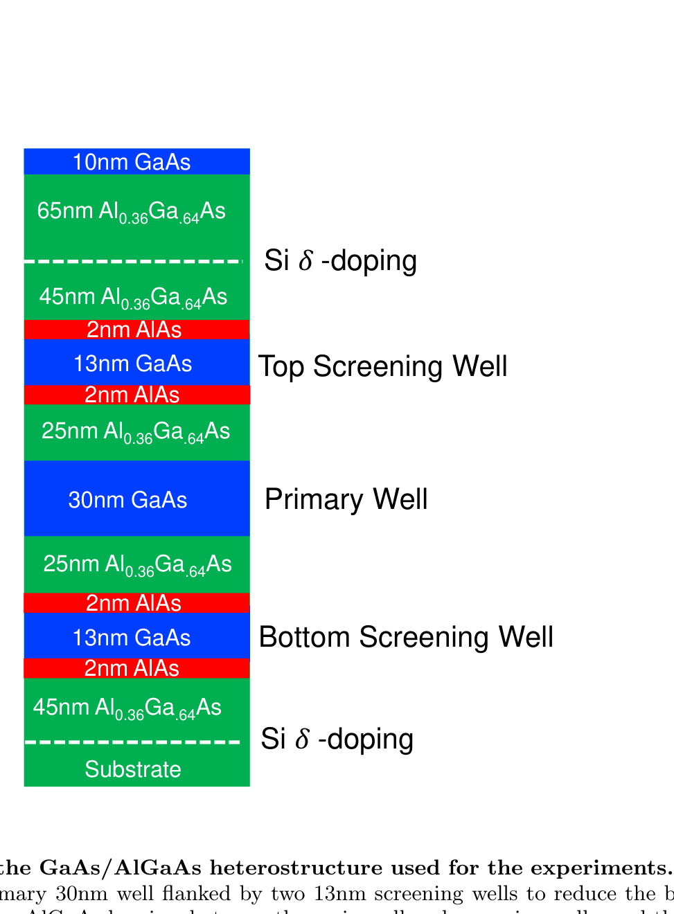
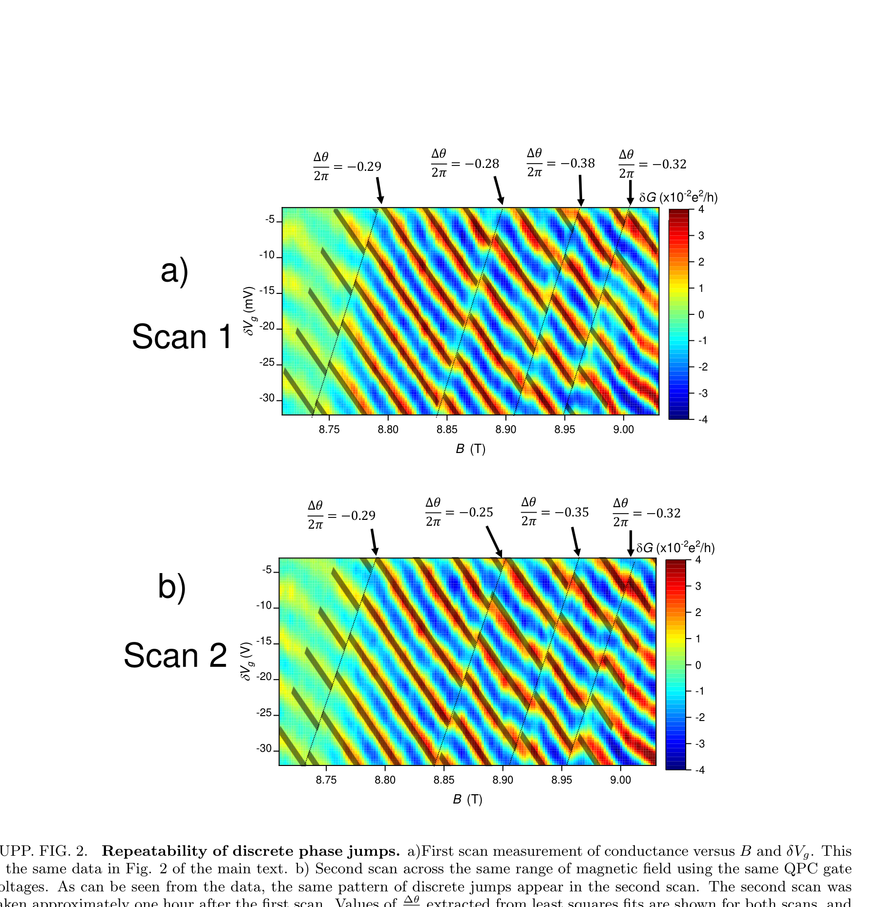
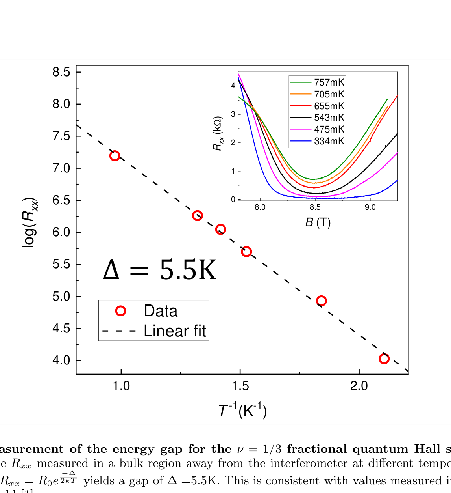
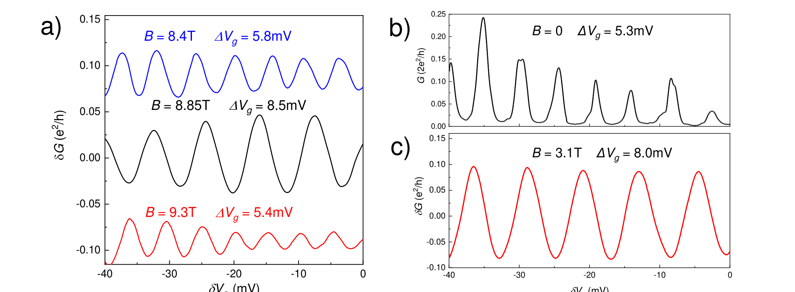
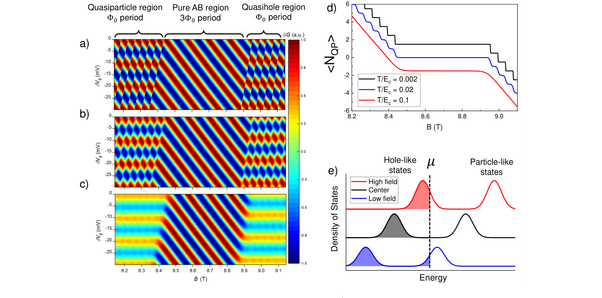
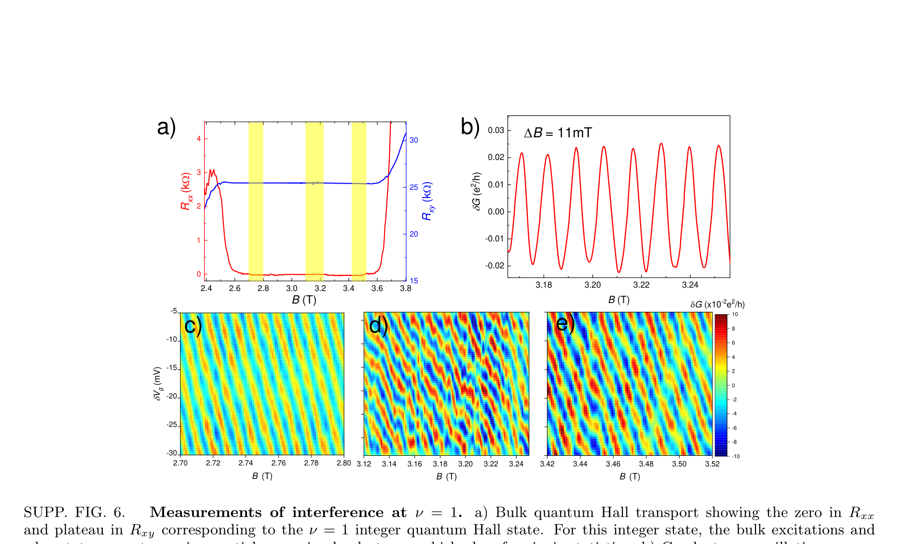
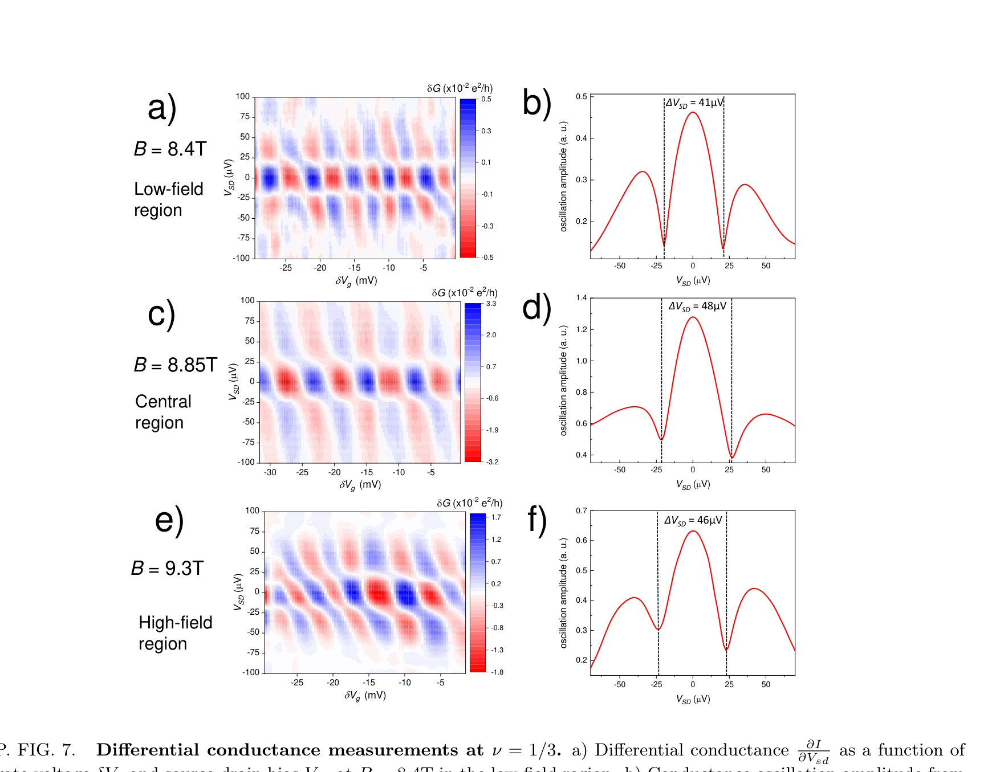
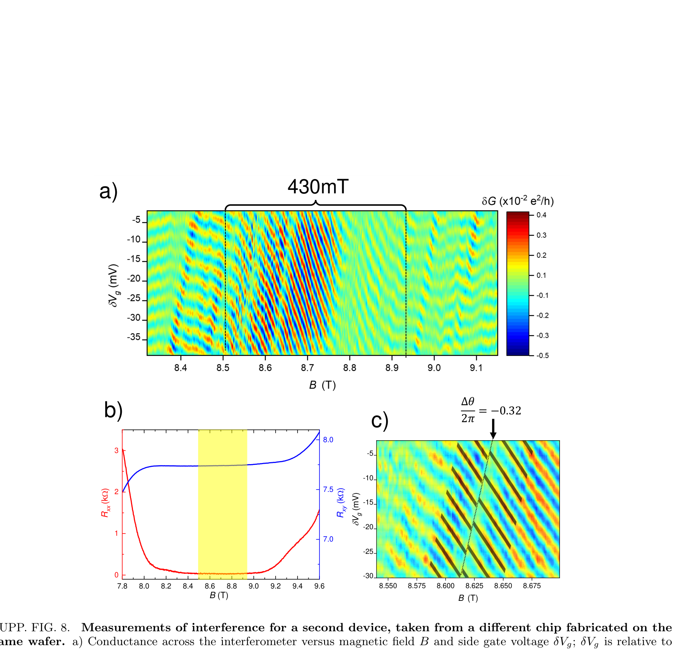

# "ν=1/3 fractional quantum Hall state에서 anyonic braiding statistics의 직접 관측"에 대한 Supplementary Information

*Supplementary Information for "Direct observation of anyonic braiding statistics at the ν=1/3 fractional quantum Hall state"*

> 원문: arXiv:2006.14115v1 [cond-mat.mes-hall], 2020년 6월 25일
> Supplementary Information 한국어 번역

---

## Supplementary 그림: Layer Stack

**SUPP. FIG. 1. 실험에 사용된 GaAs/AlGaAs heterostructure의 layer stack.** 이 구조는 세 개의 GaAs quantum well을 활용한다: interferometer의 bulk-edge interaction을 줄이기 위해 두 개의 13nm screening well이 양옆에 배치된 primary 30nm well이다. main well과 screening well 사이에는 25nm AlGaAs barrier가 있으며, main well로부터 screening well까지의 총 중심간(center-to-center) setback은 48nm이다.

> *(layer stack 도해 — 위에서 아래로):* 10nm GaAs / 65nm Al$_{0.36}$Ga$_{0.64}$As (Si δ-doping) / 45nm Al$_{0.36}$Ga$_{0.64}$As / 2nm AlAs / 13nm GaAs (Top Screening Well) / 2nm AlAs / 25nm Al$_{0.36}$Ga$_{0.64}$As / 30nm GaAs (Primary Well) / 25nm Al$_{0.36}$Ga$_{0.64}$As / 2nm AlAs / 13nm GaAs (Bottom Screening Well) / 2nm AlAs / 45nm Al$_{0.36}$Ga$_{0.64}$As (Si δ-doping) / Substrate

---

## Supplementary 그림: 재현성과 energy gap

**SUPP. FIG. 2. 이산적인 phase jump의 재현성.** a) $B$와 $\delta V_g$에 대한 conductance의 첫 번째 scan 측정. 이는 본문 그림 2와 동일한 데이터이다. b) 동일한 QPC gate voltage를 사용하여 같은 magnetic field 범위에 걸쳐 수행한 두 번째 scan. 데이터에서 볼 수 있듯이, 같은 패턴의 이산적인 jump가 두 번째 scan에서도 나타난다. 두 번째 scan은 첫 번째 scan으로부터 약 1시간 후에 수행되었다. least-squares fit으로부터 추출된 $\frac{\Delta\theta}{2\pi}$ 값이 두 scan 모두에 대해 표시되어 있으며, 두 scan에서 각 phase jump에 대해 유사한 값을 보인다.

**SUPP. FIG. 3. ν = 1/3 fractional quantum Hall state의 energy gap 측정.** inset은 서로 다른 온도에서 interferometer로부터 떨어진 bulk 영역에서 측정한 longitudinal resistance $R_{xx}$를 보인다. 데이터를 $R_{xx} = R_0 e^{\frac{-\Delta}{2k_B T}}$ 형태로 한 linear fit은 $\Delta = 5.5$K의 gap을 산출한다. 이는 유사한 magnetic field에서의 이전 실험 측정값과 일치한다 [1].

---

## SUPPLEMENTARY DISCUSSION 1: ANALYSIS OF PERIODS AND LEVER ARMS

우리는, 소자가 소수의 phase jump를 동반한 주로 Aharonov-Bohm interference 거동을 나타내는 중심 영역으로부터, 등위상선이 평평해지는 높고 낮은 field 영역으로의 interference 거동 변화를 논의한다. 흥미롭게도, 등위상선이 연속적으로 유지됨에도 불구하고, side gate oscillation 주기는 중심 영역에 비해 높고 낮은 field 영역에서 더 작아지며, 8.4T에서 5.8mV, 8.85T에서 8.5mV, 9.3T에서 5.4mV의 주기를 갖는다. Supp. Fig. 4에는 이 magnetic field들에서 gate voltage에 대한 conductance의 line cut이 나타나 있어 주기 변화를 보여준다. 한편, [2]의 모델은 side gate oscillation 주기가 위·아래 field 영역에서와 중심 영역에서 동일할 것이라고 시사하는데, 이는 저자들이 side gate voltage가 오직 Aharonov-Bohm phase에만 영향을 주어 $\theta$의 $V_g$에 따른 변화가 각 영역에서 동일하다고 가정하기 때문이다. 실제 소자에서 gate는 면적만 바꾸는 것이 아니라 interferometer bulk의 전하에도 어느 정도 영향을 미친다. 높고 낮은 field 영역에서 이는 localize된 quasiparticle 수의 변화로 인해 gate voltage에 따른 추가적인 phase 변화로 이어진다. 이것이 side gate oscillation 주기에 미치는 영향을 분석하기 위해, Supp. Eqn. 1에서 우리는 (본문 Eqn. 1로부터) $\theta$를 side gate voltage에 대해 미분한다:

$$\frac{\partial\theta}{\partial V_g} = 2\pi\frac{e^*}{e}\frac{B}{\Phi_0}\frac{\partial A_I}{\partial V_g} + \theta_{anyon}\frac{\partial\langle N_L\rangle}{\partial V_g} \tag{1}$$

여기서 $\langle N_L\rangle$로 우리는 thermally averaged quasiparticle 수를 취하는데, 이는 높고 낮은 field regime에서 상당한 thermal smearing이 예상되며 $\langle N_L\rangle$이 반드시 정수일 필요는 없다는 사실을 반영하기 위함이다 [2].

gate voltage에 따른 localize된 quasiparticle 수의 변화가 관측된 주기 변화를 설명할 수 있는지 결정하기 위해, 우리는 interferometer 내부의 bulk 전하 $q_{bulk}$가 $V_g$에 따라 어떻게 변하는지를 매개변수화하는 매개변수 $\alpha_{bulk} \equiv \frac{\partial q_{bulk}}{\partial V_g}$를 결정한다. $\alpha_{bulk}$를 결정하기 위해 우리는 QPC를 weak tunneling으로 조정한 채 zero magnetic field의 Coulomb blockade regime [3]에서 소자를 작동시켰다. 이 regime에서는 소자 내 전자 수가 하나씩 변할 때마다 conductance peak가 하나씩 나타난다. Coulomb blockade oscillation 주기의 역수는 side gate를 interferometer에 결합시키는 total lever arm $\alpha_{total} \equiv \frac{1}{\Delta V_{CB}} = \frac{\partial q_{total}}{\partial V_g}$를 준다. zero-field Coulomb blockade oscillation은 Supp. Fig. 4b에 도시되어 있으며, 5.4mV 주기는 $\alpha_{total} = 0.19$mV$^{-1}$를 산출한다. 그러나 $q_{total}$은 edge의 전하와 bulk의 전하의 결합, 즉 $q_{total} = q_{edge} + q_{bulk}$이므로, $\alpha_{bulk}$를 결정하려면 $\alpha_{edge} \equiv \frac{\partial q_{edge}}{\partial V_g}$도 결정해야 한다. $\alpha_{edge}$를 추출하기 위해 우리는 소자를 integer quantum Hall state ν = 1에서 Aharonov-Bohm interferometer로 작동시킨다. 이 regime에서 interference phase, 따라서 oscillation 주기는 interference 면적의 변화에만 의존하고 bulk에 localize된 전하의 변화에는 의존하지 않는다 [4]. integer state에서는 각 oscillation 주기가 둘러싸인 flux를 하나씩 바꾸는 것에 해당하므로, $\alpha_{edge} = n\frac{\partial A_I}{\partial V_g} = \frac{n\Phi_0}{B}\frac{1}{\Delta V_{\nu=1}}$이다. 여기서 $n$은 전자 밀도이다(우리는 gate가 edge 및 bulk와 결합하는 것을 결정하는 electrostatics가 magnetic field에 따라 크게 변하지 않는다고 가정한다). integer state ν = 1에 대한 AB interference oscillation은 Supp. Fig. 4c에 나타나 있으며, 8.0 mV의 주기는 $\frac{\partial A}{\partial V_g} = 0.167\mu m^2 V^{-1}$과 $\alpha_{edge} = 0.12$mV$^{-1}$를 준다. 마지막으로, 우리는 $\alpha_{bulk} = \alpha_{total} - \alpha_{edge} = 0.19$mV$^{-1} - 0.12$mV$^{-1} = 0.07$mV$^{-1}$를 계산한다. $\alpha_{edge}$가 $\alpha_{bulk}$보다 상당히 크다는 사실은, 예상대로 side gate의 주된 작용이 interferometer의 면적을 바꾸는 것이며 bulk 전하의 변화는 상대적으로 작다는 것을 가리킨다.

우리는 ν = 1/3에서 각 regime의 예상 주기를 $\Delta V_g = 2\pi(\frac{\partial\theta}{\partial V_g})^{-1}$로 계산한다. 중심 영역에서는 큰 energy gap 때문에 quasiparticle이 생성되기 어려우므로 Supp. Eqn. 1 우변의 첫 번째 항만 기여하는 반면, 낮은 field/높은 field 영역에서는 quasiparticle/quasihole이 생성되어 phase에 기여하므로 두 항 모두 기여한다. 그렇다면 중심 영역에 대한 예측 주기는 $\Delta V_g = \frac{\Phi_0}{B}\frac{e}{e^*}(\frac{\partial A_I}{\partial V_g})^{-1} \approx 8.4$mV로, 측정값 8.5mV와 잘 일치한다. 중심 영역에서 모델과의 이러한 일치는, 실제로 e/3 quasiparticle의 constant ν에서의 Aharonov-Bohm effect로 이해할 수 있으며, 이는 fractional charge에 대한 이론적 예측 [5]뿐 아니라 interferometry의 이전 실험 [6, 7] 및 fractional charge에 대한 다른 실험적 관측 [8–10]과도 일치한다. 8.4T와 9.3T에서, quasiparticle의 생성을 고려하면 우리는 다음을 계산한다:

$$\Delta V_g = \frac{1}{\frac{B}{\Phi_0}\frac{e^*}{e}\frac{\partial A_I}{\partial V_g} + \frac{\theta_{anyon}}{2\pi}\frac{\partial N_L}{\partial V_g}} = \frac{1}{\frac{B}{3\Phi_0}\frac{\partial A_I}{\partial V_g} + \alpha_{bulk}}$$

여기서 우리는 $\frac{e^*}{e} = \frac{1}{3}$, $\theta_{anyon} = \frac{2\pi}{3}$, $\frac{\partial N_L}{\partial V_g} = \frac{e}{e^*}\alpha_{bulk}$를 사용하였다. 이 식은 8.4T에서 $\approx 5.5$mV, 9.3T에서 $\approx 5.1$mV의 예측 $\delta V_g$를 산출하며, 이는 실험값 5.8mV 및 5.4mV와 잘 일치한다. 각 영역에서 예측된 oscillation 주기와 관측된 oscillation 주기 사이의 이러한 일치는, 낮은 field에서 constant $n$이고 quasiparticle population을 갖는 영역, state 중심 부근에 constant ν 영역, 높은 field에서 constant $n$이고 quasihole population을 갖는 영역이라는 [2]의 그림에 대한 강력한 뒷받침이다.

추가로, 이렇게 추출한 lever arm은 본문 그림 2의 quasiparticle transition 선의 기울기를 정량적으로 분석하는 데 사용할 수 있다. 이 transition은 quasiparticle이 소자의 특정 위치에서 생성되는 것이 energy적으로 유리해질 때 일어나며, 따라서 transition 선은 소자 상의 전하와 연관된 등(等)electrostatic energy 선에 해당할 것이다. 이 electrostatic energy는 magnetic field에 따른 condensate charge density의 변화로 인해 소자에 전하가 축적되는 데에서 비롯되며, 이는 quasiparticle의 생성으로 보상될 수 있다. 따라서 2DES 상의 전하는 condensate charge density와 각 localize된 quasiparticle과 연관된 전하의 결합이다:

$$q_{2DES} = \frac{e\nu A_I B}{\Phi_0} + e^* N_{qp} \tag{2}$$

더 나아가, 우리는 net charge $q_{net}$, 즉 (Supp. Eqn. 2로부터의) 2DES 내 전하와 background charge 사이의 차이를 고려해야 한다:

$$q_{net} = q_{2DES} - q_{back} = \frac{e\nu AB}{\Phi_0} + e^* N_{qp} - q_{donor} - e\alpha_{bulk}\delta V_g \tag{3}$$

여기서 background charge는 donor로부터의 전하 $q_{donor}$와 gate voltage의 효과의 결합이다. 우리는 [4]를 따라 gate가 어떤 유효한 추가 background charge $e\alpha_{bulk}\delta V_g$를 만들어내는 것으로 다룬다. localize된 quasiparticle 수의 변화는 electrostatic energy 비용이 quasiparticle을 생성하는 energy 비용을 초과할 때 일어나므로, Supp. Eqn. 3은 localize된 quasiparticle transition이 기울기 $\frac{dV_g}{dB} = \frac{\nu A}{\Phi_0\alpha_{bulk}}$를 갖는 선을 가로질러 일어날 것임을 의미한다. $\nu = 1/3$, $\alpha_{bulk} = 0.07$mV$^{-1}$(위에서 논의함), 그리고 ν = 1에서의 AB oscillation으로부터 추출된 면적 $A = \frac{\Phi_0}{\Delta B_{\nu=1}} \approx 0.38\mu m^2$(Supp. Fig. 6b)를 사용하면, 우리는 $\frac{dV_g}{dB} \approx 0.44$mV/mT를 얻는다. 실험적으로, 관측된 phase jump는 약 0.5 mV/mT의 기울기로 일어나며, 이는 예측값과 잘 일치한다. 이는 이산적인 phase jump가 실제로 interferometer 내부의 localize된 quasiparticle 수의 변화에 해당한다는 강력한 증거이다.

---

## Supplementary 그림: 서로 다른 magnetic field에서의 conductance oscillation

**SUPP. FIG. 4. 서로 다른 magnetic field에서의 conductance oscillation.** a) $B = 8.4$T의 낮은 field 영역(파란색), $B = 8.85$T의 중심 영역(검은색), $B = 9.3$T의 높은 field 영역(빨간색)에서 side gate voltage $\delta V_g$에 대한 conductance oscillation $\delta G$. side gate oscillation 주기 $\Delta V_{sidegates}$는 중심 영역에서보다 낮은 field 및 높은 field 영역에서 상당히 더 작으며, 8.4T에서 $\Delta V_g = 5.8$mV, 8.85T에서 $\Delta V_g = 8.5$mV, 9.3T에서 $\Delta V_g = 5.4$mV이다. QPC는 약 90%의 transmission으로 조정된다. b) 소자를 Coulomb blockade regime에서 작동시킨, zero magnetic field에서 side gate voltage에 대한 conductance $G$. 이 연구에서 제시된 다른 데이터와 달리, 여기 표시된 oscillation은 interference가 아니라 전자의 resonant tunneling에 기인하며, QPC는 weak tunneling, $G \ll \frac{e^2}{h}$으로 조정된다. Coulomb blockade oscillation은 5.3mV의 주기를 가지며, 이는 gate가 interferometer에 결합하는 total lever arm $\alpha_{total}$을 얻는 데 사용된다. c) ν = 1에서의 Aharonov-Bohm interference oscillation. 8.0mV의 oscillation 주기는 gate가 edge에 결합하는 lever arm $\alpha_{edge}$를 얻는 데 사용된다.

---

## SUPPLEMENTARY DISCUSSION 2: SIMULATIONS

[2]의 모델을 우리의 실험 결과에 적용하는 것을 더욱 입증하기 위해, 우리는 gate voltage $V_g$와 magnetic field $B$에 대한 conductance를 모델링하고자 interferometer 거동의 시뮬레이션을 수행하였다. 이를 위한 출발점은 conductance oscillation을 결정하는 interference phase 차이에 대한 식이다:

$$\theta = 2\pi\frac{e^*}{e}\frac{A_I B}{\Phi_0} + N_{qp}\theta_{anyon} \tag{4}$$

interferometer의 conductance는 $\delta G = a_0\cos(\theta)$로 변하며, $a_0$는 QPC의 backscattering에 의존하는 진폭이다. 우리 계에서는 $N_{qp}$의 thermal fluctuation이 중요할 수 있으므로 thermal average를 계산해야 한다(우리는 저주파 측정 기법을 사용하므로, 이 thermal average는 실험적으로 측정된 conductance에 해당해야 한다). [4]를 따라, 우리는 thermal expectation value $\langle\delta G\rangle$를 계산한다:

$$e\langle\delta G\rangle = \frac{1}{Z}\sum_{N_{qp}=-\infty}^{+\infty} e^{\frac{-E(N_{qp})}{k_B T}}\cos\left(2\pi\frac{e^*}{e}\frac{A_I B}{\Phi_0} + N_{qp}\theta_{anyon}\right) \tag{5}$$

$$Z = \sum_{N_{qp}=-\infty}^{+\infty} e^{\frac{-E(N_{qp})}{k_B T}} \tag{6}$$

여기서 $E$는 $N_{qp}$의 함수로서 소자의 energy이다. 본문에서와 같이, 여기서 음(-)의 quasiparticle 수는 quasihole의 population에 해당한다. 우리는 [2]의 것과 유사하되, bulk의 단위 면적당 energy가 아니라 interferometer에 대한 energy를 정의한다:

$$E = E_0 + \frac{e^2}{2C}\delta q_{net}^2 + \Delta_{qp}|N_{qp}| \tag{7}$$

$E_0$는 quasiparticle 수에 의존하지 않는 condensate의 energy를 설명하는 offset이므로, 시뮬레이션에서 제외된다. $N_{qp}$의 절댓값에 $\Delta_{qp}$를 곱하는 것은, quasihole(음(-)의 $N_{qp}$에 해당)도 energy $\Delta_{qp}$를 비용으로 든다는 사실을 반영하기 위함이며, 단순화를 위해 우리는 quasiparticle을 생성하는 데 연관된 energy $\Delta_{qp}$를 full gap의 절반, $\Delta_{qp} = \frac{\Delta}{2}$로 설정한다. 이는 quasiparticle 생성의 energy 비용이 quasihole의 경우와 같다고 가정하는 단순화인데, 수치 결과는 quasiparticle이 quasihole보다 더 높은 energy 비용을 갖는다고 가리킨 바 있다 [11]. 그럼에도 불구하고, quasiparticle이나 quasihole이 생성되지 않는 constant ν 영역의 폭은 quasiparticle gap과 quasihole gap의 합인 full gap $\Delta = \Delta_{qp} + \Delta_{qh}$에 의해 결정되며, 이 full gap이 transport에서 측정되는 값이다. 따라서 quasiparticle과 quasihole의 energy의 비대칭성은 [2]의 이론과 우리의 실험 결과 사이의 정량적 비교에 영향을 주지 않는다.

Supp. Discussion 1에서 논의했듯이, $q_{net}$은 2DES 내 전하와 (side gate가 만든 것을 포함한) 보상 background charge 사이의 차이이며, Supp. Eqn. 3에 쓰여 있다. Supp. Eqn. 7의 항 $\frac{e^2}{2C}\delta q_{net}^2$은 소자에 잉여 전하를 쌓는 것과 연관된 energy 비용을 준다. main well로부터 거리 $d$만큼 떨어진 screening layer가 있을 때, 우리는 특성 capacitance를 $C = \frac{2\epsilon A_I}{d}$로 추정한다.

magnetic field와 side gate voltage에 대한 conductance 시뮬레이션은, $B$와 $\delta V_g$의 각 값에서 Supp. Eqn. 5와 Supp. Eqn. 6을 수치적으로 평가하여 수행된다. 면적 $A_I$는 $A_I = A_0 + \frac{\partial A}{\partial V_g}\delta V_g$로 계산된다. 무한 합을 수행하는 대신, 우리는 계산을 가능하게 하기 위해 $N_{qp}$를 -20부터 +20까지 합한다. 이는 quasiparticle 수가 큰 state가 지수함수적으로 억제되기 때문에 정당화된다. 시뮬레이션은 ν = 1/3 state에 대해 수행되므로, 이론적 기대에 기반하여 우리는 $\theta_{anyon} = \frac{2\pi}{3}$, $e^* = e/3$으로 설정한다. Supp. Fig. 3의 bulk transport gap 측정으로부터 추출된 $\Delta$ 값 5.5K가 사용되었으며, 이는 $\Delta_{qp}$에 대해 2.75K의 값을 준다. background charge $q_{donor}$를 설정하는 $0.7\times10^{11}cm^{-2}$의 2DES가 가정된다.

Supp. Fig. 5a, b, c에 우리는 서로 다른 온도에서의 시뮬레이션 결과를 보인다. 온도의 thermal smearing 효과를 주로 결정하는 energy scale은 $\frac{e^2}{2C}$이므로, 우리는 a, b, c에서 $kT$와 $\frac{e^2}{2C}$의 비를 각각 0.002, 0.02, 0.1로 설정한다. 시뮬레이션의 거동을 그래프에서 보기 쉽게 하기 위해, 이 시뮬레이션들은 실제 소자보다 면적이 작은 소자로 수행된다. 우리는 $A_0 = 0.1\mu m^2$로 설정하는데, 실제 소자의 경우 Aharonov-Bohm 주기에 기반하면 $A_0 \approx 0.38\mu m^2$이다. 우리는 먼저 a)의 저온 시뮬레이션에 초점을 맞춘다. 시뮬레이션의 정성적 특징은 실험과 일치한다: 주기 $3\Phi_0$의 음(-)의 기울기를 갖는 Aharonov-Bohm oscillation이 중심 부근에서 일어나며, 이 거동은 530mT 영역에 국한된다([2]의 모델로부터 계산된 값과 일치하며 실험적으로 관측된 값 $\approx 450$mT에 가깝다). 이 영역의 위·아래에서 a)의 시뮬레이션은, [2]의 발견과 일치하게, 주기 $\Phi_0$로 일어나는 sharp하게 정의된 이산적인 phase jump를 보인다. b)와 c)에서 온도가 증가함에 따라, 이 phase jump의 transition은 thermal smear되어 함께 합쳐지며, 시뮬레이션된 가장 높은 온도 값에서는 phase의 transition이 거의 완전히 smear out되어 시뮬레이션이 거의 평평한 등(等)conductance 선을 보인다. 이는 실험 결과와 좋은 정성적 일치를 보인다.

시뮬레이션의 또 다른 미묘한 특징은, 중심의 Aharonov-Bohm 영역에서 quasiparticle 및 quasihole 영역으로의 transition이 $V_g - B$ 평면에서 양(+)의 기울기를 갖는 선을 가로질러 일어난다는 것인데, 이는 시뮬레이션에 포함된 side gate와 bulk 사이의 결합 $\alpha_{bulk}$ 때문이다. 이 거동은 실제로 높은 field 영역으로의 transition에서 실험 데이터에 관측된다. 낮은 field transition에서는 transition이 갑작스럽기보다는 더 부드럽게 일어나는 것으로 보여 이 거동이 덜 명확하지만, 양(+)의 기울기는 여전히 관측 가능하다.

Supp. Fig. 5d에는, 각 온도에서의 시뮬레이션으로부터 thermally averaged quasiparticle 수 $\langle N_{qp}\rangle$의 line cut을 $B$에 대해 도시하였다. 저온에서 이는, localize된 quasiparticle 수를 바꾸는 것이 energy적으로 유리해질 때 매우 sharp한 transition을 갖는 계단 모양의 함수를 형성하는 반면, 고온에서는 이 transition들이 thermal smear되어 진화가 상당히 부드러워진다. 우리의 단순화된 모델과 시뮬레이션이 소자의 모든 physics를 포착하지는 못할 것이지만, 우리는 고온에서 평균 quasiparticle 수가 thermal smear된다는 이 그림이 성립할 것이라고 본다. 추가로, charge noise 같은 다른 메커니즘이 측정 시간 scale에서 $\langle N_{qp}\rangle$의 smearing을 일으킬 가능성도 있다.

---

## Supplementary 그림: 시뮬레이션 결과

**SUPP. FIG. 5. ν = 1/3에서 interferometer 거동의 시뮬레이션.** conductance 값은, Aharonov-Bohm phase와 interferometer bulk 내부의 localize된 quasiparticle 둘레의 braiding으로부터의 기여 $\theta_{anyon}$을 모두 고려하여, magnetic field $B$와 side gate voltage $V_g$의 함수로 계산된다. 시뮬레이션은 온도 $k_B T$와 interferometer charging energy $E_c = \frac{e^2}{2C}$의 서로 다른 비에서 수행된다: a) 0.002, b) 0.02, c) 0.1. d) 서로 다른 $k_B T/E_c$ 비에 대해 interferometer 내부의 localize된 quasiparticle 수의 thermal expectation value를 도시한 그래프. 이 맥락에서 음(-)의 quasiparticle 수는 quasihole의 population을 가리킨다. 각 경우 state의 중앙에서는 quasiparticle이 없어 $3\Phi_0$ 주기의 통상적인 Aharonov-Bohm interference가 나타나는 반면, 더 높은 field에서는 quasihole이, 더 낮은 field에서는 quasiparticle이 형성되어 $\Phi_0$ 주기의 phase slip이 나타난다. 온도가 상승함에 따라 quasiparticle 수가 thermal smear되어, $\Phi_0$ 주기의 phase slip을 관측 불가능하게 만들고 $V_g$의 함수로 일어나는 oscillation의 진폭을 감소시킨다. e) energy에 대한 density of states의 정성적 그래프.

> *(패널 라벨):* Quasiparticle region $\Phi_0$ period / Pure AB region $3\Phi_0$ period / Quasihole region $\Phi_0$ period / Hole-like states / μ / Particle-like states / 범례: T/E$_c$ = 0.002, 0.02, 0.1

---

## SUPPLEMENTARY DISCUSSION 3: VELOCITY MEASUREMENTS

본문에서 우리는, ν = 1/3에서 온도 감쇠 scale이 중심 영역에서보다 높고 낮은 field 영역에서 훨씬 작다는 관측을 논의하였는데, 이는 interferometer 내부의 localize된 quasiparticle 수의 thermal smearing으로 인한 topological dephasing이 높고 낮은 field 영역에서 기여할 수 있음을 시사한다. 그러나 $T_0$의 변화에 대한 또 다른 가능한 설명은, edge velocity가 중심에서 훨씬 크고 높고 낮은 field 영역에서 감소할 수 있다는 것이다. 만약 그렇다면, $T_0$는 단순히 edge state의 추가적인 thermal smearing 때문에 감소할 것이다(다만, 비교적 좁은 $B$ 범위에 걸쳐 velocity가 이렇게 크고 비단조적으로 변하는 것은 다소 놀라운 일일 것이다). $T_0$의 변화가 edge velocity $v_{edge}$의 변화로 설명될 수 있는지 결정하기 위해, 우리는 각 영역에서 $v_{edge}$를 추출할 수 있는 differential conductance 측정을 수행하였다 [12]. 이는 Aharonov-Bohm interferometer의 integer quantum Hall state에 대해 이전에 수행된 바 있다 [6, 13, 14]. 우리는 먼저 integer 전하 edge state의 경우를 고려한다. 유한한 source-drain voltage bias가 인가되면, 주입된 edge 전자의 energy가 변하고, 이는 edge dispersion으로부터 phase의 shift $\delta\theta = \delta e\frac{\partial k}{\partial\epsilon}L = \frac{\delta eL}{\hbar v_{edge}}$로 이어진다. 이는 source-drain bias $V_{sd}$의 함수로 일어나는 추가적인 interference 패턴으로 이어지며, 이는 differential conductance 측정에서 관측될 수 있어, $V_{sd}$와 $\delta V_g$의 함수로 측정된 differential conductance에 checkerboard 패턴을 만들어낸다. 따라서 $\delta V_g$의 함수로 일어나는 conductance oscillation의 node는 특정 $V_{sd}$ 값에서 일어나며, node 사이의 간격은 edge velocity를 추출하는 데 사용될 수 있다 [6, 12, 14, 15]:

$$v_{edge} = \frac{e^* L\Delta V_{sd}}{2\pi\hbar} \tag{8}$$

여기서 $L$은 interferometer의 둘레로, Aharonov-Bohm interference 측정으로부터 추출된 면적에 기반하여 $L = 4\sqrt{A_I} \approx 2.5\mu m$로 추정된다. ν = 1/3에서의 differential conductance 측정은 Supp. Fig. 7에 나타나 있다. 또한 데이터의 Fourier 변환으로부터 추출된 oscillation 진폭을 $V_{sd}$에 대해 도시하였는데, 이는 $\Delta V_{sd}$의 편리한 추출을 가능하게 한다 [14]. 이는 낮은 field 영역에 대해 a)와 b)에, 중심 영역에 대해 c)와 d)에, 높은 field 영역에 대해 e)와 f)에 나타나 있다. Supp. Eqn. 8을 사용하면, $B = 8.4$T의 낮은 field 영역에서 $8.3\times10^3$m/s, $B = 8.85$T의 중심 영역에서 $9.7\times10^3$m/s, $B = 9.3$T의 낮은 field 영역에서 $9.3\times10^3$m/s의 edge velocity가 산출된다. velocity가 magnetic field에 따라 크게 변하지 않는다는 사실은, edge velocity의 변화로는 영역들 사이의 온도 감쇠 scale $T_0$의 큰 변화를 설명할 수 없음을 가리킨다. 예상되는 $T_0$는 $T_0 = \frac{h}{2\pi k_B\tau}\frac{1}{g}$로 계산될 수 있다 [12, 16]. 여기서 $g$는 edge state의 scaling exponent로, ν = 1/3에 대해 $g = \frac{1}{3}$이며 [12], $\tau = \frac{L}{v_{edge}}$는 edge state가 interferometer를 가로지르는 시간이다. 이는 edge state의 thermal smearing에 기반하여 $B = 8.4$T에서 76mK, 8.85T에서 89mK, 9.3T에서 85mK의 $T_0$를 예측한다. 8.85T의 중심 영역에서 예측값 89mK는 실험적으로 관측된 $T_0$ 94mK에 가까운데, 이는 소자가 quasiparticle이 거의 없는 영역에서 진폭의 감쇠가 edge의 thermal smearing으로 돌려질 수 있음을 가리킨다. 우리는 integer quantum Hall state ν = 1에서도 예측된 $T_0$와 관측된 $T_0$ 사이의 유사한 일치를 관측한 바 있다 [6]. 그러나 ν = 1/3에서 낮은 field 영역의 31mK와 높은 field 영역의 32mK의 실험적으로 관측된 $T_0$는 edge의 thermal smearing에 대해 예측된 값보다 훨씬 작으며, 이는 또 다른 dephasing 메커니즘이 작용해야 함을 가리킨다. 이는 localize된 quasiparticle의 thermal smearing으로 인한 topological dephasing이 이 영역들의 dephasing에 기여한다는 이론에 대한 추가적인 뒷받침을 제공한다.

---

## Supplementary 그림: ν = 1에서의 interference와 differential conductance

**SUPP. FIG. 6. ν = 1에서의 interference 측정.** a) ν = 1 integer quantum Hall state에 해당하는 $R_{xx}$의 영점과 $R_{xy}$의 plateau를 보이는 bulk quantum Hall transport. 이 integer state에서 bulk excitation과 edge state 전류를 운반하는 입자는 단순히 전자이며, 이들은 fermionic statistics를 따른다. b) magnetic field에 대한 conductance oscillation으로, oscillation 주기 $\Delta B = 11$mT를 보인다. 이 주기로부터 interferometer의 유효 면적 $A_I$를 추출할 수 있다: $A_I = \frac{\Phi_0}{\Delta B}$. c), d), e)에는 plateau의 낮은 field 영역, plateau 중심 부근, plateau의 높은 field 쪽에서 interferometer 양단의 $B$와 $\delta V_g$에 대한 conductance를 보인다. 각 pajama plot에 해당하는 plateau 상의 영역은 a)에 표시되어 있다. 이 영역들 각각에서 소자는 음(-)의 기울기를 갖는 Aharonov-Bohm oscillation을 나타낸다. 이는 등위상선이 높고 낮은 field에서 평평해지는 ν = 1/3 state에 대한 본문 데이터와 대조된다. 이는 ν = 1에서 전류를 운반하고 localize된 state를 형성하는 전자가 trivial한 braiding statistics $\theta_{fermion} = 2\pi$를 따르는 fermion이라는 사실과 일치하며, 이로써 braiding이 관측 불가능하고 interference 거동에 변화가 없게 된다.

**SUPP. FIG. 7. ν = 1/3에서의 differential conductance 측정.** a) $B = 8.4$T의 낮은 field 영역에서 side gate voltage $\delta V_g$와 source-drain bias $V_{sd}$의 함수로서 differential conductance $\frac{\partial I}{\partial V_{sd}}$. b) $V_{sd}$의 함수로서 conductance 대 side gate voltage 데이터의 FFT로부터 얻은 conductance oscillation 진폭. oscillation 진폭은 $V_{sd}$의 함수로 node 패턴을 보이며, 이로부터 edge velocity를 추출할 수 있어 $v_{edge} = 8.3\times10^3$m/s를 산출한다. c) differential conductance와 d) 8.85T에서 $V_{sd}$에 대한 oscillation 진폭으로, $v_{edge} = 9.7\times10^3$m/s를 준다. e) differential conductance와 f) 9.3T에서 $V_{sd}$에 대한 oscillation 진폭으로, $v_{edge} = 9.3\times10^3$m/s를 준다. 분명히, edge velocity는 ν = 1/3 quantum Hall plateau 전체에 걸쳐 크게 변하지 않는다.

**SUPP. FIG. 8. 같은 wafer에서 제작된 다른 chip으로부터 취한 두 번째 소자의 interference 측정.** a) magnetic field $B$와 side gate voltage $\delta V_g$에 대한 interferometer 양단의 conductance. $\delta V_g$는 -1.0V 기준의 상대값이다. 거동은 본문에서 기술한 소자에서 관측된 것과 유사하다: 폭 $\approx 430$mT의 유한한 영역에서 소자는 음(-)의 기울기를 갖는 Aharonov-Bohm oscillation을 나타내며, 이는 더 높고 더 낮은 magnetic field에서 평평해지는데 이는 quasiparticle과 quasihole의 생성과 일치한다. b) 소자 B에 대해 $R_{xx}$(빨간색)와 $R_{xy}$(파란색)를 보이는 bulk magnetotransport. 음(-)의 기울기를 갖는 Aharonov-Bohm oscillation이 일어나는 ν = 1/3 state 중심 부근의 영역이 강조되어 있다. c) 데이터에서 명확한 phase jump를 확대한 모습(이 jump는 b)에서도 보이지만, c)의 데이터는 signal-to-noise를 개선하기 위한 다른 scan이다). phase jump 양쪽에서 conductance의 least-squares fit은 추출된 phase jump $\frac{\Delta\theta}{2\pi} = -0.32$를 산출하며, 이는 이론과 일치하는 anyonic phase $\theta_{anyon} = 2\pi\times0.32$를 준다.

---

## SUPPLEMENTARY DISCUSSION 4: POSSIBLE BULK-EDGE INTERACTION EFFECTS

우리는 일부 실험적 관측에 대한 또 다른 가능한 설명을 논의한다. quantum Hall interferometer에서, integer quantum Hall state에 대해서도, phase에 이산적인 변화를 일으킬 수 있는 또 다른 메커니즘이 있다는 점은 언급할 가치가 있다. Aharonov-Bohm regime과 Coulomb-dominated regime의 중간에 있는 소자에서는, interferometer 내부에 localize된 전하의 생성이 유한한 bulk-edge coupling으로 인해 interferometer의 면적을 변하게 하여, Aharonov-Bohm phase의 감소와 interference phase의 가시적인 이산적 변화를 일으킨다. 이 메커니즘은 exotic한 braiding statistics에 의존하지 않는다 [4]. 그러나 magnetic field를 증가시키는 것은 particle-like quasiparticle을 제거하거나 hole-like quasiparticle을 생성하는 경향이 있다. 어느 경우든 각 excitation은 magnetic field가 증가할 때 phase의 증가로 이어지는데, 이는 $N_{qp}$의 감소가 $A_I$의 보상적 증가를 동반할 것이기 때문이다. 그러나 이는, 각 이산적인 phase jump를 가로지르는 음(-)의 phase 변화를 관측한 우리의 결과 및 이 이산적인 phase jump가 Aharonov-Bohm phase가 명확한 음(-)의 기울기를 보이는, 즉 bulk-edge interaction이 최소임을 가리키는 영역에서 일어난다는 사실과 일치하지 않는다. 그럼에도 불구하고, 일부 잔류 bulk-edge interaction이 관측된 phase jump에 작은 영향을 미칠 가능성은 있다. [4]에서는 quasiparticle 수를 바꿀 때 관측되는 phase의 jump가 $\Delta\theta = \theta_{anyon}\times(1 - \frac{K_{IL}}{K_I})$이어야 한다는 것이 밝혀졌다. 여기서 $\frac{K_{IL}}{K_I}$는 bulk-edge interaction 강도 $K_{IL}$과 edge를 charging하는 특성 energy 비용 $K_I$의 비이다. 따라서 잔류 bulk-edge interaction은 관측되는 phase 변화를 약간 더 작게 만들 것이다. 이는 관측된 phase jump의 대다수가 $\frac{2\pi}{3}$보다 약간 작다는 사실을 설명할 수 있을 것이다.

---

## SUPPLEMENTARY REFERENCES

[1] Du, R. R., Stormer, H. L., Tsui, D. C., Pfeiffer, L. N., & West, K. W. Experimental Evidence for New Particles in the Fractional Quantum Hall Effect. *Phys. Rev. Lett.* **70**, 2944-2947 (1993)

[2] Rosenow, B., & Stern, A. Flux Superperiods and Periodicity Transitions in Quantum Hall Interferometers. *Phys. Rev. Lett.* **124**, 106805 (2020)

[3] Beenakker, C. W. J. Theory of Coulomb-blockade oscillations in the conductance of a quantum dot. *Phys. Rev. B* **44**, 1646-1656 (1991)

[4] Halperin, B. I., Stern, A., Neder, I., & Rosenow, B. Theory of the Fabry-Perot quantum Hall interferometer. *Phys. Rev. B* **83**, 155440 (2011)

[5] Laughlin, R. B. Anomalous Quantum Hall Effect: An Incompressible Quantum Fluid with Fractionally Charged Excitation. *Phys. Rev. Lett.* **50**, 1395-1398 (1983)

[6] Nakamura, J. et al. Aharonov-Bohm interference of fractional quantum Hall edge modes. *Nat. Phys.* **15**, 563-569 (2019)

[7] Ofek, N., Bid, A., Heiblum, M., Stern, A., Umansky, V., & Mahalu, D. Role of interactions in an electron Fabry-Perot interferometer operating in the quantum Hall effect regime. *Proceedings of the National Academy of Sciences* **107**, 5276-5281 (2010)

[8] Goldman, V. J. Resonant tunneling in the quantum Hall regime: measurement of fractional charge. *Science* **267**, 1010-1012 (1995)

[9] de-Picciotto, R. et al. Direct observation of a fractional charge. *Nature* **389**, 162-164 (1997)

[10] Saminadayar, L., Glattli, D. C., Lin, Y., & Etienne, B. Observation of the e/3 Fractionally Charged Laughlin Quasiparticle. *Phys. Rev. Lett.* **79**, 2526-2529 (1997)

[11] MacDonald, A. H., & Girvin, S. M. Quasiparticle states in the fractional quantum Hall effect. *Phys. Rev. B* **34**, 5639-5653 (1986)

[12] Chamon, C. de C., Freed, D. E., Kivelson, S. A., Sondhi, S. L., & Wen, X. G. Two point-contact interferometer for quantum Hall systems. *Phys. Rev. B* **55**, 2331-2343 (1997)

[13] McClure, D. T., et al. Edge-State Velocity and Coherence in a Quantum Hall Fabry-Perot Interferometer. *Phys. Rev. Lett.* **103**, 206806 (2009)

[14] Gurman, I., Sabo, R., Heiblum, M., Umansky, V., & Mahalu, D. Dephasing of an electronic two-path interferometer. *Phys. Rev. B* **93**, 121412 (R) (2016)

[15] Litvin, L. V., Helzel, A., Tranitz, H.-P., Wegscheider, W., & Strunk, C. Edge-channel interference controlled by Landau level filling. *Phys. Rev. B* **78**, 075303 (2008)

[16] Bishara, W., Bonderson, P., Nayak, C., Shtengel, K., & Slingerland, J. K. Interferometric signature of non-Abelian anyons. *Phys. Rev. B* **80**, 155303 (2009)
